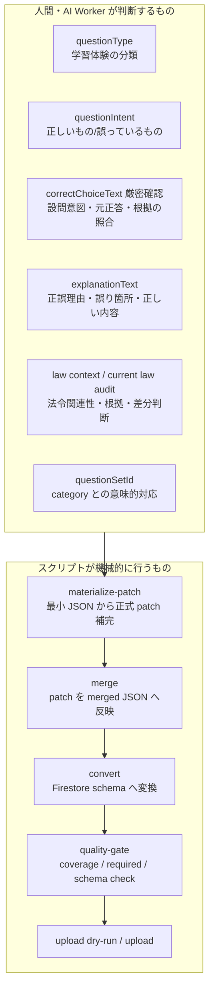
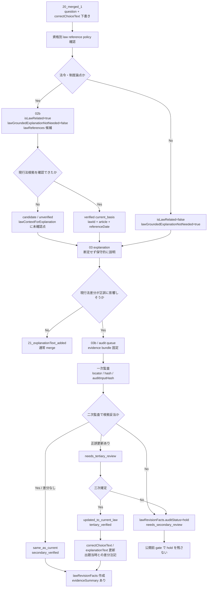
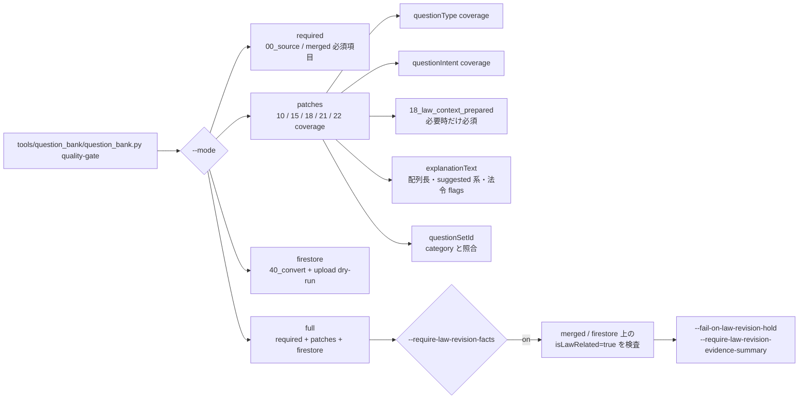
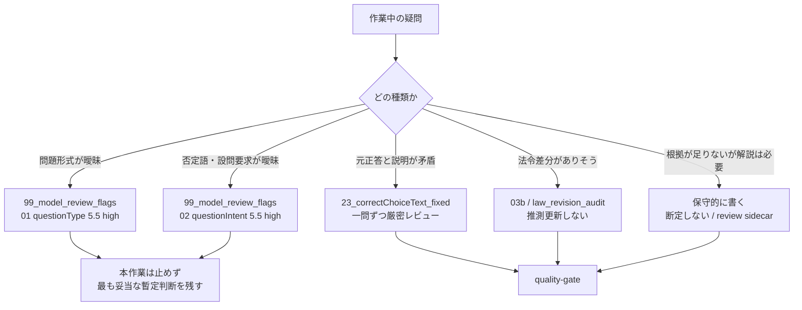

# `code.py` から Firestore upload までの全体フロー

この文書は、`code.py` やサイト別スクレイパの実行から Firestore upload までの現行運用をまとめた正本です。旧AI patch 自動実行スクリプトは廃止し、現在は task ごとの patch 作成と `prepare_firestore_upload.py` を組み合わせて運用します。

## 0. 全体像

大きな流れは次の順序です。

1. `config/scrape_presets.json` で資格・対象回・スクレイパを定義する
2. `scripts/scrape/run_qualification_scrape.py` または個別スクレイパで過去問を取得する
3. `00_source/` と `question_images/<list_group_id>/` を作る
4. `01_prompt_fix_questionType.md` で `10_questionType_fixed/` を作る
5. `00_merge_all.py` で `12_merged_questionType/` と `20_merged_1/` を作る
6. `02_prompt_fix_questionIntent.md` で `15_correctChoiceText_fixed/` を作る
7. merge / 下書き補完で `questionIntent + answer_result_text` 由来の `correctChoiceText` を整える
8. 厳密レビューが必要な設問は `23_correctChoiceText_fixed/` で最終 `correctChoiceText` を一問ずつ見直す
9. `02b_prompt_prepare_law_context.md` で `18_law_context_prepared/` を作り、法令フラグと現行法根拠候補を先に整理する
10. `03_prompt_add_explanationText.md` で `21_explanationText_added/` を作る
11. `04_prompt_link_questionSetId.md` で `22_questionSetId_linked/` を作る
12. `00_merge_all.py` と `prepare_firestore_upload.py` で `30_merged_2/`、`40_convert/`、`upload_to_firestore/` を更新する
13. 画像を Storage に dry-run / upload する
14. category と questions を Firestore に dry-run / upload する

`correctChoiceText` の 99.99% 水準レビューや `explanationText` の品質改善は、単なるスクリプト実行では完了扱いにしません。対象設問ごとに、正しい回答、設問意図、根拠、解説品質を一問ずつ確認します。この確認は一般的な人間の目視ではなく、その資格の専門家、問題作成者、参考書著者が教材として公開できる水準を想定します。

法令問題では、スクレイピング元の正誤は出題当時の公式正答または掲載元の正誤を反映しているものとして扱う。03の前に02bで `isLawRelated` と現行法根拠候補を整理し、03ではその情報を使って解説本文と想定質問を作る。現行法と突き合わせ、明らかに正誤が異なる場合は現行法ベースへ `correctChoiceText` / `explanationText` を更新する。その場合は、更新した事実、出題当時の正答、現行法の根拠条項を `explanationText`、`suggestedQuestions`、`suggestedQuestionDetails`、`lawReferences`、review sidecar に残し、ユーザーにも「現行法に合わせて更新済み」と伝わるようにする。`isLawRelated` は upload 可能な import metadata として扱えるが、`lawAnswerBasis` などの現行法更新専用 field は未対応のため、repaso 側の schema / Firestore rules / UI 更新なしに通常 upload JSON へ混入させてはいけない。

## 0.1 全体ワークフロー図

通常の整備は、`00_source` を直接直さず、各工程の patch を作って merge し、最後に Firestore 変換と dry-run で schema を確認する流れです。

```mermaid
flowchart LR
  Preset["config/scrape_presets.json<br/>資格・対象回・サイト設定"] --> Scrape["scrape runner / site scraper"]
  Scrape --> Source["00_source<br/>スクレイピング正本"]
  Scrape --> Images["question_images/&lt;list_group_id&gt;<br/>ローカル画像"]

  Source --> QType["01 questionType<br/>10_questionType_fixed"]
  QType --> MergeA["merge<br/>12_merged_questionType / 20_merged_1"]
  Source --> MergeA

  MergeA --> Intent["02 questionIntent<br/>15_correctChoiceText_fixed"]
  Intent --> CorrectDraft["answer_result_text + questionIntent<br/>correctChoiceText 下書き"]
  CorrectDraft --> Merged1["20_merged_1<br/>解説作成前の主入力"]

  Merged1 --> LawContext["02b law context<br/>18_law_context_prepared"]
  LawContext --> Merged1Law["merge<br/>20_merged_1 に法令情報反映"]

  Merged1Law --> Explanation["03 explanation<br/>21_explanationText_added"]
  Merged1Law --> QuestionSet["04 questionSetId<br/>22_questionSetId_linked"]
  Explanation --> Merged2["merge<br/>30_merged_2"]
  QuestionSet --> Merged2

  CorrectReview["厳密 correctChoiceText review<br/>23_correctChoiceText_fixed"] --> Merged2
  Merged2 --> Convert["convert<br/>40_convert"]
  Convert --> UploadJson["upload_to_firestore"]
  Images --> Storage["Storage dry-run / upload"]
  UploadJson --> FirestoreDryRun["Firestore dry-run<br/>schema validation"]
  FirestoreDryRun --> Firestore["Firestore upload"]
```



## 0.2 人間判断とスクリプト責務



判断本文の量産を Python に寄せないでください。Python を使ってよい範囲は、退避、正式 patch 化、merge、convert、下書き補完、coverage check、schema validation、upload dry-run / upload です。

### 0.2.1 ローカル問題レビューUI

人間がJSONを直接読み回らずに、問題、全選択肢、正誤、解説、patch合成後、`40_convert`、本番Firestoreを比較するためのローカルUI仕様は、[local_question_review_console.md](local_question_review_console.md)を正本とする。

このUIは既存workflowを置き換えない。通常は例外だけを人間へ提示し、指摘からCodex用依頼を生成する。直接編集は初期版では`correctChoiceText`と解説系fieldだけに限定し、`21_explanationText_added`又は`23_correctChoiceText_fixed`へ保存する。`00_source`とFirestoreはUIから変更しない。

## 0.3 法令問題の分岐図

法令問題は、通常の03解説作成へ入る前に02bで `isLawRelated` と現行法根拠候補を整理します。法改正・現行法差分が疑われる場合だけ03bへ切り出します。



法令監査の正本は `lawRevisionFacts` と review sidecar です。条文本文の長文を question doc に保存せず、`lawId`、`lawRevisionId`、`elm`、`articleTextHash`、raw XML hash などの locator と hash で再現性を確保します。

## 0.4 quality-gate 図

日常運用では、個別 script を直接探す前に `tools/question_bank/question_bank.py` を入口にします。



代表コマンド:

```bash
python tools/question_bank/question_bank.py quality-gate \
  --qualification <qualification> \
  --list-group-id <list_group_id> \
  --require-law-context-stage \
  --require-is-law-related \
  --require-law-grounded-flag \
  --require-law-revision-facts \
  --require-law-evidence-utilization \
  --require-law-references-for-law-related
```

## 0.5 押さえるべき仕様境界

| 領域 | 押さえること | 破ると起きること |
| --- | --- | --- |
| `00_source` | スクレイピング正本。原則直接編集しない。 | 出典・元正答・元本文の追跡が崩れる。 |
| patch 出力 | 各工程は固定ディレクトリへ patch を出す。source と件数・ID を一致させる。 | merge 不能、patch coverage 不足、別問題への誤適用。 |
| `questionType` | 回答体験の分類。資格ごとに意味を変えない。 | アプリ表示・分割 convert・復習体験が壊れる。 |
| `questionIntent` | 正しいもの/誤っているものの設問要求。AI が `correctChoiceText` を直接推測しない。 | 正答ラベルが逆転する。 |
| `correctChoiceText` | `answer_result_text`、`questionIntent`、厳密レビュー、法令監査の関係を崩さない。 | 過去問としての元正答と現行法更新が混ざる。 |
| `explanationText` | 正誤、誤り箇所、正しい内容、根拠を選択肢単位で書く。 | 正答は合っていても学習データとして使えない。 |
| `suggestedQuestions` | 画面表示時に AI を自動起動しないための事前質問。 | UI 上の補足導線が空になる。 |
| `suggestedQuestionDetails` | `{question, answer}` のみ。`question` は `suggestedQuestions[i]` と一致。 | Firestore schema / app 読み取りが壊れる。 |
| `isLawRelated` | 02b以降の法令問題抽出軸。全件に付ける運用。 | 年次監査対象を取りこぼす。 |
| `lawGroundedExplanationNotNeeded` | 互換フラグ。原則 `!isLawRelated`。 | 法令問題なのに根拠不要扱いになる。 |
| `lawReferences` | 軽量 locator。条文本文は持たず、verified は lawId + article まで確認。 | 根拠条文の再現性が落ちる。 |
| `lawRevisionFacts` | 現行法監査・自由質問 AI・条文確認 UI の正本。 | 現行法更新の理由と監査状態が追えない。 |
| review sidecar | 不確実性、5.5 high、法令監査履歴を残す。Firestore へ入れない。 | 作業判断の経緯が消える。 |
| Firestore schema | 未知キーを増やさない。追加するなら repaso rules/model/schema も同時更新。 | upload dry-run またはアプリ読み取りで破綻する。 |
| `questionSetId` | upload 前に必須。`category.json` と照合する。 | アプリ内の問題集へ表示できない。 |

## 0.6 判断を止める・切り出すポイント



迷いを patch 本体の未知キーで表現しないでください。正式 patch は契約どおりの field だけにし、迷いは sidecar、review queue、goal notes に分けます。

## 正本の場所

- スクレイピング実装（サイト別）:
  `/Users/yuki/development/exam_scraper/code.py`（kakomonn 系）
  `/Users/yuki/development/exam_scraper/scrape_gassyunin.py`（gassyunin.com）
  `/Users/yuki/development/exam_scraper/scrape_sgsiken.py`（sg-siken.com）
- スクレイピング実行ランナー（資格プリセット対応）:
  `/Users/yuki/development/exam_scraper/scripts/scrape/run_qualification_scrape.py`
- スクレイピング共通ヘルパ:
  `/Users/yuki/development/exam_scraper/scripts/scrape/common.py`
- Firestore 前処理:
  `/Users/yuki/development/exam_scraper/scripts/pipeline/prepare_firestore_upload.py`
- 日常整備の統一CLI:
  `/Users/yuki/development/exam_scraper/tools/question_bank/question_bank.py`
- 過去問 field 契約:
  `/Users/yuki/development/exam_scraper/document/reference/question_field_contract.md`
- merge:
  `/Users/yuki/development/exam_scraper/scripts/merge/00_merge_all.py`
- upload:
  `/Users/yuki/development/exam_scraper/scripts/upload/upload_questions_to_firestore.py`
  `/Users/yuki/development/exam_scraper/scripts/upload/upload_category_to_firestore.py`
- prompt:
  `/Users/yuki/development/exam_scraper/prompt/`
- skill:
  `/Users/yuki/development/exam_scraper/skills/exam-firestore-pipeline/`

## 1. スクレイピングで最初に設定するもの

基本は「資格プリセット + ランナー」を使う（推奨）。

- scrape preset:
  `/Users/yuki/development/exam_scraper/config/scrape_presets.json`
- 実行:
  `/Users/yuki/development/exam_scraper/scripts/scrape/run_qualification_scrape.py`

ランナーは site ごとの実装差分を隠蔽し、各スクレイパへ以下の環境変数を渡して実行する:

- `SCRAPER_QUALIFICATION_CODE`
- `SCRAPER_QUALIFICATION_NAME`
- `SCRAPER_LIST_FIRST_PAGE_URL`
- `SCRAPER_OUTPUT_LIST_GROUP_ID`（※ output 側の `list_group_id`。数字のみ運用）
- `SCRAPER_MAX_QUESTIONS`（任意）
- `SCRAPER_OUTPUT_DIR`（任意）

（後方互換）従来通り `code.py` を直接実行する運用も残す。

`code.py` 直接実行で主に使う設定:

- `LIST_FIRST_PAGE_URL`
- `QUALIFICATION_CODE`
- `QUALIFICATION_NAME`
- `JSON_SUBDIR_NAME`
- `MAX_QUESTIONS`
- `TARGET_URL`
- `TARGET_LIST_PAGE_NUMBER`
- `UPDATE_JSON_MODE`

## 2. スクレイパが自動で行うこと

- 一覧ページから問題 URL を収集する
- 各問題ページから問題文、選択肢、解説、画像 URL を抽出する
- `public_question_id` を生成する
- 画像ファイルをローカル保存する
- `00_source` JSON を出力する

## 3. 出力先

```text
output/<qualification>/
  question_images/<list_group_id>/
  questions_json/<list_group_id>/
    00_source/
    10_questionType_fixed/
    12_merged_questionType/
    15_correctChoiceText_fixed/
    18_law_context_prepared/
    20_merged_1/
    21_explanationText_added/
    22_questionSetId_linked/
    23_correctChoiceText_fixed/
    24_questionIssueCorrections/
    30_merged_2/
    40_convert/
  questions_json/upload_to_firestore/
  category/category.json
```

各ディレクトリの意味:

- `00_source/`: スクレイピング結果の正本。原則として手で直接編集しない。
- `10_questionType_fixed/`: `questionType` patch。
- `15_correctChoiceText_fixed/`: 互換上の名前を維持した `questionIntent` patch。
- `12_merged_questionType/`: merge 時に生成される中間確認用 view。手作業 patch の出力先ではない。
- `18_law_context_prepared/`: 03前に作る法令コンテキスト patch。`isLawRelated`、`lawGroundedExplanationNotNeeded`、必要な `lawReferences` を持つ。
- `20_merged_1/`: `questionType`、`questionIntent`、`answer_result_text` 由来の `correctChoiceText` 下書きを反映した、解説作成前の主入力。
- `21_explanationText_added/`: `explanationText` patch。
- `22_questionSetId_linked/`: `questionSetId` patch。
- `23_correctChoiceText_fixed/`: 最終 `correctChoiceText` の厳密レビュー patch。
- `24_questionIssueCorrections/`: 問題報告を blind A/B と challenge で客観レビューした後の correction overlay。case/input/review/evidence hash を持つ。
- `30_merged_2/`: explanation / questionSetId / correctChoiceText を反映した upload 前 merged。
- `40_convert/`: Firestore schema 向け変換結果。
- `upload_to_firestore/`: Firestore upload 用 JSON。

### 3.1 生成物・保存タイミング・ファイル名

`<source_stem>` は元ファイル名から `.json` を除いた stem です。例: `00_source/question_85010_1.json` なら `<source_stem>=question_85010_1`。patch checker は一部の timestamp 付き legacy ファイルも扱えますが、日常作業では固定名で上書きし、同じ工程のファイルを増やさない方針です。

| タイミング | 保存先 | ファイル名パターン | 作るもの / 注意 |
| --- | --- | --- | --- |
| scrape 直後 | `output/<qualification>/questions_json/<list_group_id>/00_source/` | `question_<list_group_id>_<n>.json` などサイト実装ごとの `question_*.json` | スクレイピング正本。手で直接編集しない。 |
| scrape 直後 | `output/<qualification>/question_images/<list_group_id>/` | scraper が保存した画像ファイル名 | ローカル画像。Firestore では `question_images/official/<qualification>/<filename>` の公開URLへ寄せる。 |
| 01 `questionType` | `10_questionType_fixed/` | `<source_stem>_questionType_fixed.json` | `questionType` patch。AI最小JSONは `materialize-patch --task question_type` で正式 patch 化する。 |
| 01 merge 後 | `12_merged_questionType/` | `<source_stem>_merged.json` | `questionType` 反映後の中間 view。手作業 patch の出力先ではない。 |
| 01/02 merge 後 | `20_merged_1/` | `<source_stem>_merged.json` | 03前の主入力。`questionType`、`questionIntent`、`correctChoiceText` 下書き、02b法令コンテキストを反映する。 |
| 02 `questionIntent` | `15_correctChoiceText_fixed/` | `<source_stem>_merged_correctChoiceText_fixed.json` | 互換名は `correctChoiceText_fixed` だが、実質は `questionIntent` patch。timestamp 付き legacy は最新を選ぶ。 |
| 02b `law_context` | `18_law_context_prepared/` | `<source_stem>_merged_lawContext_prepared.json` | 03前の法令コンテキスト patch。`isLawRelated`、`lawGroundedExplanationNotNeeded`、必要な `lawReferences` を持つ。 |
| 03 `explanation` | `21_explanationText_added/` | `<source_stem>_merged_explanationText_added.json` | `explanationText`、`suggestedQuestions`、`suggestedQuestionDetails` patch。timestamp 付き legacy は最新を選ぶ。 |
| 04 `questionSetId` | `22_questionSetId_linked/` | `<source_stem>_merged_questionSetId_linked.json` | `category.json` を根拠に `questionSetId` を紐付ける patch。 |
| 厳密正答レビュー | `23_correctChoiceText_fixed/` | `<source_stem>_merged_correctChoiceText_fixed.json` | 03以降の後追い補正用。`correctChoiceText` を一問ずつ専門家目線で確認した結果だけ入れる。 |
| 問題報告 correction | `24_questionIssueCorrections/` | `<batch>_<work>_<originalQuestionId>.json` | `00_source` を変更せず、blind A/B + challenge を通った変更だけを overlay。`expectedBeforeHash` 不一致で停止し、case ID を patch から追跡できる。 |
| 最終 merge 後 | `30_merged_2/` | `<source_stem>_merged.json` | explanation / questionSetId / 最終 correctChoiceText を反映した upload 前 merged。 |
| Firestore 変換 | `40_convert/` | `<list_group_id>_firestore_<YYYYMMDD_HHMMSS>.json` | Firestore schema 相当の `questions[]`。upload 前 schema validation の対象。 |
| upload 準備 | `questions_json/upload_to_firestore/` | `<list_group_id>_firestore_<YYYYMMDD_HHMMSS>.json` | Firestore upload 用 JSON。通常は `40_convert` 由来。 |
| category 整備 | `output/<qualification>/category/` | `category.json` | `questionSetId` の正本。04と upload 前検証で参照する。 |
| report 整理 | `output/<qualification>/reports/` | `<qualification>-*.json` など | root 直下に出たレポートは `organize-reports` でここへ寄せる。 |
| 不確実性メモ | `<list_group_id>/99_model_review_flags/` | `<source_stem>_<stage>_needs_5_5_high_review.jsonl` | patch 本体に未知キーを入れず、5.5 high 再確認対象を sidecar として残す。 |
| 法令 evidence snapshot | `output/<qualification>/law_evidence/<list_group_id>/current_article_snapshots/` | `<list_group_id>_current_article_snapshots_<timestamp>.jsonl` | verified `lawReferences` から取得した現行条文 snapshot。raw XML は `raw_xml/<timestamp>/`。 |
| 法令監査 queue | `output/<qualification>/review/law_revision_audit/` | `<list_group_id>_law_revision_audit_queue_<timestamp>.jsonl` / `*_summary.json` | `lawRevisionFacts` 未整備・hold の監査対象。判断済み成果物ではなく固定入力。 |
| hold facts 初期化 | `21_explanationText_added/` | `<patch>_hold_facts_<timestamp>.json` | queue から `hold` の `lawRevisionFacts` を explanation patch へ初期化する中間成果物。公開確定ではない。 |

生成物の責務を迷ったら、次の原則で判断します。

- 正本入力は `00_source`。原則編集しない。
- 人間判断は patch ディレクトリに保存する。
- merge / convert / upload 用 JSON は機械生成物として扱う。
- 不確実性、監査履歴、未確認点は patch 本体に未知キーを混ぜず、sidecar / review queue / reports に分ける。
- Firestore に入れる可能性がある新規 field は、`document/reference/question_field_contract.md`、repaso schema、convert/upload、quality-gate を同時に更新するまで通常 JSON に入れない。

画像の扱い:

- ローカル画像は引き続き `output/<qualification>/question_images/<list_group_id>/` に保存する。
- Firestore JSON に入れる公開URLは `question_images/official/<qualification>/<filename>` のフラット構成を正本とする。
- `list_group_id` や年度は公開URLに含めない。
- Storage への画像アップロードも同じフラット構成にする。

## 4. スクレイピング

推奨（資格プリセット経由）:

```bash
cd /Users/yuki/development/exam_scraper
python3 scripts/scrape/run_qualification_scrape.py sg 201902 --max-questions 5
```

従来（個別実行）:

```bash
cd /Users/yuki/development/exam_scraper
python3 code.py 85010
```

## 4.1 新しいサイト（新スクレイパ）の追加チェックリスト

「細かい指示なしでサイト差分を吸収して、パイプラインに通す」ための最小手順。

1) スクレイパ実装（`/Users/yuki/development/exam_scraper/scrape_<site>.py`）
   - `scripts/scrape/common.py` の `prepare_output_dirs()` と `save_question_body_chunks()` を使い、`output/<qualification>/questions_json/<list_group_id>/00_source/` に JSON を出す
   - 画像は `output/<qualification>/question_images/<list_group_id>/` に保存し、JSON には `make_storage_url()` で Storage 公開URL（`question_images/official/<qualification>/<filename>`）を埋める
   - `SCRAPER_*` 環境変数で上書きできるようにする（上の一覧）
2) `config/scrape_presets.json` に資格エントリ追加
   - `scraper_type` を追加し、`list_first_page_url_template` と `scrape_targets`（source→output）を定義
3) `scripts/scrape/run_qualification_scrape.py` のルーティングへ `scraper_type` を追加
4) テスト追加
   - 既定は `python3 -m unittest discover -s tests -p 'test_*.py'`
   - ライブ依存テストは `RUN_LIVE_TESTS=1` の時だけ走るようにする（サイト改修で壊れやすいため）
5) 最小の手動検証
   - スクレイピング直後（カテゴリ/questionSetId 連携前）は source 必須項目だけを見る:
     - `python3 tools/question_bank/question_bank.py quality-gate --qualification <qualification> --list-group-id <list_group_id> --mode required`
   - `question_set` patch（`22_questionSetId_linked/`）を作成し、merge 反映後は標準ゲートを通す:
     - `python3 tools/question_bank/question_bank.py quality-gate --qualification <qualification> --list-group-id <list_group_id>`

注意:
- `questionSetId` はカテゴリ作成/リンク工程の責務で、スクレイピング直後の convert 出力では空になり得る。
- repaso 側のスキーマ（required/allowed）により、`questionSetId` は upload 前に必ず非空にする必要がある。

## 5. AI 整形

AI 整形は task ごとの patch を手動または Codex/Gemini/Claude で作る。正答精度と解説品質を上げる場合は、次の順序を標準とする。

1. `question_type`
   - prompt: `prompt/01_prompt_fix_questionType.md`
   - 主入力: `00_source/question_*_*.json`
   - 補助入力: 必要時のみローカル派生 JSON
   - 外部Web: 禁止
   - 出力: `10_questionType_fixed/`
2. merge
   - `10_questionType_fixed/` を反映して `20_merged_1/` を更新する
3. `question_intent`
   - prompt: `prompt/02_prompt_fix_questionIntent.md`
   - 主入力: `20_merged_1/question_*_merged.json`
   - 補助入力: 不足時のみ `00_source/question_*_*.json`
   - 外部Web: 禁止
   - 出力: `15_correctChoiceText_fixed/`
   - 注意: `02` は `correctChoiceText` 直接判定用ではなく、`questionIntent` 精査用
4. merge / correctChoiceText 下書き補完
   - `questionIntent + answer_result_text` の整合から `correctChoiceText` を整える
   - `correctChoiceText` の厳密レビューでは、`questionIntent`、`answer_result_text`、選択肢、元解説を1問ずつ突き合わせる
   - 99.99% レビューでは、この下書き補完だけでは完了扱いにしない
5. `law_context`
   - prompt: `prompt/02b_prompt_prepare_law_context.md`
   - 主入力: `20_merged_1/question_*_merged.json`
   - 補助入力: 対象資格の `prompt/qualification_docs/<qualification>/` と必要時のみ `00_source/`
   - 外部Web: 法令・制度根拠の確認に限り、信頼できる一次情報を許可
   - 出力: `18_law_context_prepared/`
   - 注意: ここでは `explanationText` を書かない。03で使う `isLawRelated`、`lawGroundedExplanationNotNeeded`、現行法の `lawReferences` 候補を整理する
6. merge
   - `18_law_context_prepared/` を反映して `20_merged_1/` を更新する
   - 03は、法令コンテキストが入った `20_merged_1/` を主入力にする
7. `explanation`
   - prompt: `prompt/03_prompt_add_explanationText.md`
   - 主入力: `20_merged_1/question_*_merged.json`
   - 補助入力: 必要時のみ `23_correctChoiceText_fixed/` と `00_source/`
   - 外部Web: 法令・数値・定義の裏取りに限り、信頼できる一次情報を許可
   - 出力: `21_explanationText_added/`
   - 法令問題: 02bの `isLawRelated` / `lawReferences` を解説本文に活用する。現行法と出題当時法令の差分が疑われるだけで確定できない場合は正誤を変えず、03bまたは5.5 high 再確認フラグへ送る。
8. `question_set`
   - prompt: `prompt/04_prompt_link_questionSetId.md`
   - 主入力: `20_merged_1/question_*_merged.json` と `category.json`
   - 出力: `22_questionSetId_linked/`

patch 作成後は、必要な check を通したうえで merge に進む。`explanationText` は正しい `questionType`、`questionIntent`、`correctChoiceText` を前提に作る。

### 5.1 goal での厳密レビュー

正答精度を `99.99%` 水準まで上げる goal では、`1 Worker = 1問` を基本単位にする。完了条件は file-level check の通過ではなく、各設問で次が確認されること。

レビュー担当 Worker は「一般的な目視確認者」ではなく、対象資格の専門家、問題作成者、参考書著者の観点で判断する。つまり、正答を当てるだけでは不十分で、受験者に誤学習を与えない根拠、出題意図、類似論点との境界、解説としての教えやすさまで確認する。

- `questionType` が問題形式と一致している
- `questionIntent` が設問の要求と一致している
- `answer_result_text` と `questionIntent` から導かれる `correctChoiceText` が正しい
- `explanationText` が正誤、根拠、誤り箇所、正しい内容、必要な法令・制度・技術根拠を満たしている
- 参考書や公式教材に載せても破綻しない説明になっている

汎用テンプレートは `docs/goals/templates/manual-patch-quality/` に置く。

### 5.2 スクリプト利用の境界

品質判断そのものを Python で量産しない。Python を使ってよい範囲は、退避、最小 JSON の正式化、merge、convert、下書き補完、coverage check、schema validation、upload dry-run / upload です。

- `scripts/fix/archive_patch_outputs.py`: 既存 patch の退避
- `tools/question_bank/question_bank.py materialize-patch`: AI 最小 JSON から正式 patch JSON への補完
- `scripts/fix/auto_assign_correct_choice_text.py`: `correctChoiceText` の下書き補完

日常運用の検証入口は次に統一する。

- `tools/question_bank/question_bank.py quality-gate`: coverage / required fields / schema 検証の標準入口

`scripts/check/*` は上記CLIから呼ばれる内部実装または互換入口として扱う。

`scripts/fix/README.md` に legacy / 注意対象の補助スクリプトを明記している。日常運用では README の分類を確認してから使う。

### 5.3 法令問題の現行法更新

法令問題では、掲載元やスクレイピング結果の正誤をそのまま現行法の正誤として扱わない。まず02bで `20_merged_1`、資格別 law reference policy、必要なら `00_source/` を読み、e-Gov、官公庁資料、資格別に認めた公式資料、Lawzilla などで現行法根拠候補を整理する。03はこの情報を使って説明文を作り、正誤更新が必要そうな場合は03bで監査する。

現行法で正誤が明らかに異なる場合は、`correctChoiceText` と `explanationText` を現行法ベースへ更新する。ただし、出題当時の正答を消し込むのではなく、更新した事実をユーザーに伝える。現行 schema で即アップロードできる範囲では、解説本文の注記、想定質問、保存済み回答、`lawReferences.role="current_basis"` / `role="exam_time_basis"`、`comparisonStatus="differs_from_current"`、`differenceNote`、5.5 high sidecar を使う。

repaso 側の schema / Firestore rules / UI を更新する場合は、question 直下に `lawAnswerBasis`、`lawAnswerUpdatedFromExamTime`、`originalExamTimeCorrectChoiceText`、`lawAnswerUpdateNote` のような正式フラグを追加し、解説画面で「現行法に合わせて更新済み」と表示できるようにする。これらは現時点の upload schema では未対応なので、実装前に通常 upload JSON へ入れてはいけない。

差分が疑われるが確認できない場合は、現行法ベースへ更新しない。保守的に出題当時正答で説明し、5.5 high 再確認フラグに `current_vs_historical_rule` として残す。

## 6. merge

```bash
python3 scripts/merge/00_merge_all.py 85010 \
  --base-dir output/2nd-class-kenchikushi/questions_json
```

## 7. Firestore 前処理

単一 `list_group_id` を処理する場合:

```bash
python3 scripts/pipeline/prepare_firestore_upload.py 85010 \
  -b output/2nd-class-kenchikushi/questions_json \
  --questionset-only
```

資格コードを指定して配下の全 `list_group_id` を順に更新する場合:

```bash
python3 scripts/pipeline/prepare_firestore_upload.py 2nd-class-kenchikushi \
  --questionset-only
```

必要に応じて使うオプション:

- `--skip-merge`
- `--skip-qset-check`
- `--skip-update-category-counts`
- `--upload-dry-run`
- `--dry-run`

既存 JSON の画像URLを一括で正規化したい場合:

```bash
python3 scripts/fix/rewrite_image_storage_urls.py \
  --output-root output
```

確認だけ行う場合:

```bash
python3 scripts/fix/rewrite_image_storage_urls.py \
  --output-root output \
  --dry-run
```

このコマンドは `questions_json/` 配下の現行 JSON だけを対象にし、各ディレクトリの `old/<timestamp>/` に退避してから書き換える。既存の `old/` 配下は対象外。

## 8. 画像 Storage upload

資格配下の画像を一括で確認する場合:

```bash
python3 -m pip install -r requirements_firestore.txt

python3 scripts/upload/upload_question_images_to_storage.py \
  2nd-class-kenchikushi \
  --dry-run
```

未アップロード画像だけをアップロードする場合:

```bash
python3 scripts/upload/upload_question_images_to_storage.py \
  2nd-class-kenchikushi
```

既存画像も再アップロードする場合:

```bash
python3 scripts/upload/upload_question_images_to_storage.py \
  2nd-class-kenchikushi \
  --overwrite
```

特定の `list_group_id` だけ確認する場合:

```bash
python3 scripts/upload/upload_question_images_to_storage.py \
  2nd-class-kenchikushi \
  --list-group-id 85010 \
  --dry-run
```

このコマンドはローカルの `question_images/<list_group_id>/` を走査し、Storage へは `question_images/official/<qualification>/<filename>` としてアップロードする。同名画像が複数の `list_group_id` にある場合はハッシュ一致を確認し、一致すれば1回だけアップロードする。不一致なら衝突として停止する。

デフォルト対象は `questions_json/<list_group_id>/` が存在する `list_group_id` の画像だけに限定する。`.DS_Store` などの隠しファイルと非画像拡張子はアップロード対象外。

## 9. Firestore upload

アップロード時のスキーマは、repaso 側の以下を正本として扱う:

- Firestore rules: `/Users/yuki/StudioProjects/repaso/firestore.rules`
- モデル定義:
  - `lib/firestore/models/folder_doc.dart`
  - `lib/firestore/models/question_set_doc.dart`
  - `lib/firestore/models/question_doc.dart`

`exam_scraper` 側では `upload_*_to_firestore.py` が上記スキーマ（required/allowed + 型）に合致することを検証してから書き込む。
`--dry-run` でも検証は走るため、アップロード前のチェックに使える。

category dry-run 相当:

```bash
python3 scripts/upload/upload_category_to_firestore.py \
  output/2nd-class-kenchikushi/category/category.json \
  --licenseName "二級建築士"
```

category 本番:

```bash
python3 scripts/upload/upload_category_to_firestore.py \
  output/2nd-class-kenchikushi/category/category.json \
  --licenseName "二級建築士" \
  --upload
```

questions dry-run:

```bash
python3 scripts/upload/upload_questions_to_firestore.py \
  output/2nd-class-kenchikushi/questions_json/upload_to_firestore/85010_firestore_<YYYYMMDD_HHMMSS>.json \
  --dry-run
```

questions 本番:

```bash
python3 scripts/upload/upload_questions_to_firestore.py \
  output/2nd-class-kenchikushi/questions_json/upload_to_firestore/85010_firestore_<YYYYMMDD_HHMMSS>.json
```

## 10. 注意点

- `questionSetId` は `category.json` の `questionSets[].questionSetId` を正本とする
- `folderId` を `questionSetId` に使わない
- `upload_questions_to_firestore.py` は `--dry-run` を外すと本番 upload になる
- `upload_category_to_firestore.py` は `--upload` を付けた時だけ本番 upload になる
- `upload_question_images_to_storage.py` は既定で既存 object をスキップし、`--overwrite` の時だけ再アップロードする
- `category.json` の件数更新は `2_update_category_counts.py --latest-upload-only --write` を使う

## 11. 進捗の見える化（作業量の目安）

新しい資格サイトを追加して「00_source → Firestore upload まで」通すための作業を、粗い粒度で見積もるためのチェックリスト。

- スクレイパ追加（最短）: 半日〜1日
  - 00_source 出力（画像含む）まで
  - `prepare_firestore_upload.py --dry-run` が通る（questionSetId なしなら `--skip-qset-check`）
- AI 整形（量に依存）: 数時間〜数日
  - questionType / questionIntent / correctChoiceText / explanation / questionSetId の各 task を回す
- Storage/Firestore upload: 30分〜数時間
  - 画像アップロード（初回は時間が伸びる）
  - category/questions の dry-run → 本番
