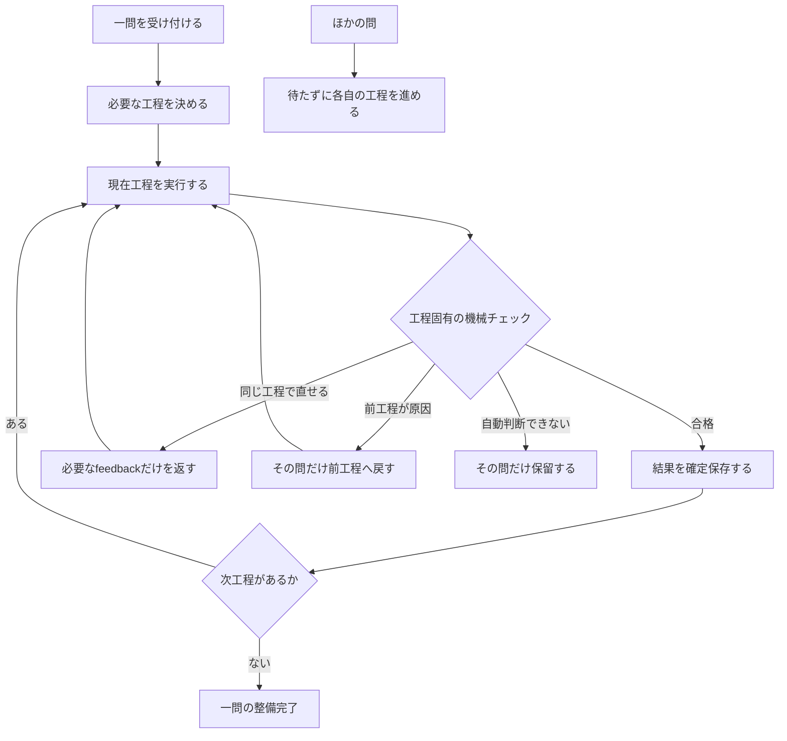

# 問題整備ワークフロー

この文書は、`exam_scraper`で問題を取得してから公開するまでの**唯一の入口**です。ここには全体の順序と各正本の要旨だけを置き、field、コマンド、UI、法令監査などの詳細はリンク先で管理します。

## 全体フロー

1. **取得・保護**：`資格・取得設定` → `scrape` → **`00_source`**
2. **整備**：公式過去問は`01〜03` ／ それ以外・混在は`05 独自問題化` → `01〜03`
3. **資格別の後工程**：`03b 現行法監査（対象のみ）` → `03c category.json（未準備時）` → `04 問題集`
4. **公開前検査**：`merge / convert` → `quality-gate / upload dry-run` → **評価待ち**
5. **評価・反映**：問題ごとの別sessionで評価 → **合格：Firestore反映** ／ **不合格：再整備後に公開前検査へ戻る**

## 一問整備の基本仕様

> **一問 = 問題文 + 全選択肢 + 正答 + 解説**

問題整備システムは最大100個の処理枠を持ち、一問ごとに独立して整備します。

- **同じ問の中では順番を守る。** 問題文と全選択肢の作業がそろい、機械チェックと確定保存が終わるまで、その問の一部を次工程へ渡さない。
- **問同士では待ち合わせない。** ある問が再試行中又は保留中でも、ほかの問は進める。

```mermaid
flowchart TD
    Start["一問を受け付ける"] --> Plan["必要な工程を決める"] --> Work["現在工程を実行する"] --> Check{"工程固有の機械チェック"}
    Check -->|合格| Save["結果を確定保存する"] --> Next{"次工程があるか"}
    Next -->|ある| Work
    Next -->|ない| Done["一問の整備完了"]
    Check -->|同じ工程で直せる| Retry["必要なfeedbackだけを返す"] --> Work
    Check -->|前工程が原因| Back["その問だけ前工程へ戻す"] --> Work
    Check -->|自動判断できない| Hold["その問だけ保留する"]
    Other["ほかの問"] --> Continue["待たずに各自の工程を進める"]
```

1. **工程は設定で管理する。** 順序、適用条件、prompt、ツール、更新範囲、機械チェックをworkflow設定に定義し、資格に不要な工程は省く。
2. **必要な情報だけを渡す。** 確定済みの現在内容と、その工程に必要な指示、根拠、feedbackだけを渡す。
3. **一問では同時に一工程だけを動かす。** 重複実行、古い結果の保存、二重保存を防ぐ。
4. **共有工程だけで待ち合わせる。** 資格全体の方針、カテゴリ設計、公開準備など、共通の確定が必要な場合に限る。

中断後は、確定済みの工程を保持し、最初の未完了工程から再開します。前工程が変わった場合は、影響する後続工程だけをやり直します。`hold`の問は同じ入力のまま無限再試行せず、ほかの問を進めます。一次根拠、正本又は工程版が更新された後の通常runでは、`hold`も整備が必要な問題として自動選定し、停止工程から再開します。

性能改善のため、待ち時間、モデル・ツール・機械チェック・保存の処理時間、再試行・保留理由、実際の同時実行数、工程版、入出力fingerprintを一問・一工程単位で記録します。

通常の順序は次のとおりです。

1. 資格と取得元URLを確認し、問題・画像を取得する。公式過去問以外又は混在する取得元は、全問を独自問題化する。
2. `00_source`を取得元の現在スナップショットとして保護する。手作業では変更せず、取得元が更新された場合だけ標準scraperで更新する。
3. 独自問題は05で問題文・設問・選択肢・正答を先に確定する。画像が必要な問題は、その確定内容に合う独自画像を作って同じ05 patchへ追加してから、公式過去問と同じ01以降へ進める。詳細は[独自問題作成ワークフロー](original_question_authoring_workflow.md)を正本とする。
4. トップの`listGroupId`一覧から対象年度、整備する項目、処理する問題を指定する。整備する項目は初期状態ですべて選択され、処理する問題は通常`整備が必要な問題だけ`を使う。必要工程は項目から自動で決まり、対象を一問単位で確定しながら進める。queueとsessionの実行境界は[問題整備システム](local_question_review_console.md#一問queueとsession)を参照する。
5. 法令工程を使う資格では、02bで根拠候補を準備し、03bの独立sessionで一問一肢ずつ監査する。`config/qualification_rules.json`で`law_workflow_enabled=false`とした資格は02bと03bを省略する。
6. `category.json`が未準備なら、トップ整備が03cを別sessionで自動実行し、続けて04で各問題を問題集へ紐付ける。
7. merge、convert、quality-gate、upload dry-runで機械的な公開前条件を確認する。
8. 適用対象の整備工程がすべて現行MAJORになった問題を評価待ちへ蓄積し、任意の問題を選んで、問題ごとの新しい評価sessionで客観的に確認する。
9. 不合格は新しい再整備sessionへ送り、再生成後にさらに新しい評価sessionで確認する。合格した問題だけを明示操作でFirestoreへ反映し、直後にreadbackする。

## 正本マップ

| 関心事 | 正本 | 要旨 |
| --- | --- | --- |
| 資格追加・スクレイピング | [scraping_workflow.md](scraping_workflow.md) | preset、scraper実装、ID、画像、`00_source`の取得・更新・保護条件を定義する。 |
| 独自問題化 | [original_question_authoring_workflow.md](original_question_authoring_workflow.md) | 取得元URLの確認、05、独自問題化、資格別ナレッジ、公開条件を定義する。 |
| 工程順・名称・正本文書 | [../../config/question_maintenance_workflow.toml](../../config/question_maintenance_workflow.toml) | 問題整備システムの工程カタログを一元管理する。 |
| 人間判断prompt | [../../prompt/README.md](../../prompt/README.md) | 各promptが所有する判断方法と実行境界への入口。 |
| 資格固有方針 | [../../prompt/qualification_docs/README.md](../../prompt/qualification_docs/README.md) | 出題範囲、解説、分類、法令スコープを資格単位で定義する。 |
| category.json | [../../prompt/qualification_docs/category_taxonomy_policy.md](../../prompt/qualification_docs/category_taxonomy_policy.md) | 03cで作る資格単位taxonomyの根拠、ID、検証方法を定義する。 |
| 保存先・ファイル名 | [artifact_contract.md](artifact_contract.md) | source、patch、merged、convert、review artifactの責務を定義する。 |
| field・型・必須性 | [../reference/question_field_contract.md](../reference/question_field_contract.md) | Firestoreへ至る共通field契約を定義する。 |
| 現行法監査 | [current_law_question_maintenance_workflow.md](current_law_question_maintenance_workflow.md) | 公的一次情報の取得と一次・二次・三次監査を定義する。 |
| 機械検証CLI | [../../tools/question_bank/README.md](../../tools/question_bank/README.md) | `quality-gate`など、日常的に実行するCLIの使い方を定義する。 |
| merge・convert・公開 | [delivery_workflow.md](delivery_workflow.md) | upload-ready生成、機械gate、品質確認gate、Storage・Firestore反映とreadbackを定義する。 |
| 問題整備システム | [local_question_review_console.md](local_question_review_console.md) | 複数問題の整備、後日の複数選択評価、問題ごとのFirestore反映と安全境界を定義する。 |
| バッチ成果物モニター | [batch_artifact_monitor.md](batch_artifact_monitor.md) | 問題整備runの並列稼働、保存済み成果物、公開Agent活動をread-onlyで観測するAPIと画面の境界を定義する。 |
| 作業バージョン | [local_question_review_console.md#作業バージョン](local_question_review_console.md#作業バージョン) | MAJORで洗い替え、MINORで洗い替え不要の改訂を管理する。 |
| ユーザーフィードバック対応システム | [user_feedback_response_system.md](user_feedback_response_system.md) | 常駐AI審査、スマホでの一件承認、patch確定、将来の複数レーンを定義する。現在は設計確定・実装前。 |
| 公式問題の問題報告 | [question_issue_report_workflow.md](question_issue_report_workflow.md) | blind review、correction overlay、限定公開の手順を定義する。 |
| Lawzilla利用評価 | [lawzilla_mcp_practical_review_workflow.md](lawzilla_mcp_practical_review_workflow.md) | Lawzillaの検索品質と改善点を記録するschemaを定義する。 |
| 一時資料 | [../temporary/README.md](../temporary/README.md) | 日付付き監査、移行記録、単発レビューの置き場所と削除基準。 |

## 全工程に共通する境界

- `00_source`は手作業・AI・後工程で編集・削除・改名しない。取得元の更新は、標準scraperが安定IDを維持し、成功reportに変更IDを残す場合だけ反映する。
- 人間・AIの判断結果は責務に合うpatchへ保存する。merged、convert、upload-readyを直接編集しない。
- 問題文と選択肢を結合した完全な命題を一問ずつ確認し、類似文言だけで一括判断しない。
- `questionId`、`originalQuestionId`、`questionSetId`を理由なく変更しない。
- 判断不能な問題は推測で閉じず、review sidecarまたは`hold`へ送る。
- 適用対象の整備工程が現行MAJORでなく、又は現在内容に対する現行評価MAJORの別session評価がない問題を公開しない。
- Firestoreへの書き込みは、依頼又はUI上の明示確認がある場合だけ行う。

詳細な例外や値の意味はここへ追記せず、上の正本マップから責務を選んで更新してください。

## 更新ルール

1. 仕様変更は、その仕様を所有する正本1ファイルだけへ記載する。
2. この幹では、順序・文書の責務・リンク先が変わる場合だけ更新する。
3. 他文書から同じ説明を転載せず、1から2文の要旨とリンクに置き換える。
4. 日付依存の調査結果、完了記録、移行手順は`document/temporary/`へ置く。
5. goal、receipt、生成reportは仕様の根拠にせず、必要な結論だけを恒久正本へ反映する。
