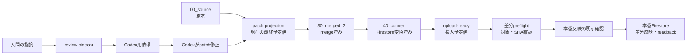

# ローカル問題レビューコンソール仕様

最終更新: 2026-07-12

## 1. 目的

問題整備のJSONを人間が直接読み回らなくても、次を一つのローカル画面で確認できるようにする。

- 問題文、全選択肢、正誤、基本解説、補足質問、法令根拠
- `00_source` と各patchを合成した最終状態
- `30_merged_2`、`40_convert`、upload-ready成果物の生成状態
- 現在の本番Firestoreとの差分
- Codexが修正した後の変更内容
- 人間が指摘した内容と、その指摘から生成したCodex用依頼

人間による全件確認を完了条件にしない。Codexと機械検査が通常整備を担当し、人間は例外を優先して確認する。

## 2. 決定事項

| 項目 | 決定 |
| --- | --- |
| 主画面 | `要確認`、`矛盾あり`、`根拠不足`などの例外キュー |
| 補助画面 | 資格、listGroupId、設問を横断する全問一覧 |
| 主な修正経路 | `修正を依頼`で指摘記録とCodex用依頼生成を一度に行い、Codexがpatchを修正 |
| 直接編集 | 可能。ただし初期版は正誤・解説系fieldに限定 |
| `00_source` | 閲覧専用。UIから変更しない |
| Firestore | 本番環境を固定し、読み取り、preflight、差分upload、readbackを行う |
| Firestore upload | 対象フォルダのupload-readyだけを、明示確認後に既存uploaderで反映 |
| Firestore一括確認 | 選択中の資格全体だけを一括読取。全資格一括とlistGroupId単位の読取は行わない |
| 環境切替 | 初期版では実装しない |
| 保存前確認 | 専用画面は作らず、保存時の小さな差分確認ダイアログだけ表示 |
| 対象資格 | ガス主任技術者で検証するが、資格固有実装にしない |
| 実装方式 | Pythonローカルサーバーと素のHTML/CSS/JavaScript。Node/npm buildは追加しない |

## 3. 非目標

初期版では次を行わない。

- UIからCodexを自動実行すること
- 複数ユーザー、ログイン、クラウド公開
- 開発・ステージング・本番Firestoreの切替
- 問題の一括編集
- `00_source` の修正
- 法令根拠や正答の妥当性をUI独自の推測で確定すること
- 既存patch、merge、convert、quality-gateを置き換えること
- 資格全体の一括upload、カテゴリ件数更新、任意JSONファイルのupload

## 4. 基本原則

### 4.1 UIは新しい問題データ正本を作らない

問題データの正本と責務は既存workflowを維持する。

- 原本: `00_source`
- 問題形式: `10_questionType_fixed`
- 設問意図・正誤下書き: `15_correctChoiceText_fixed`
- 法令コンテキスト: `18_law_context_prepared`
- 解説: `21_explanationText_added`
- 問題セット: `22_questionSetId_linked`
- 厳密な正誤修正: `23_correctChoiceText_fixed`
- 問題報告由来の補正: `24_questionIssueCorrections`
- 最終merge: `30_merged_2`
- Firestore変換: `40_convert`

UI固有のレビュー状態と指摘だけをsidecarへ保存する。問題本文を独自DBへ複製しない。

### 4.2 人間は例外を確認する

全問を順番に確認させない。最初に次の優先順で表示する。

1. Firestoreとupload予定値が不一致
2. 正誤と解説先頭が不一致
3. patch更新後にmerge・convertされていない
4. 法令問題で根拠が未確認、`hold`、又は根拠不足
5. 必須field、配列長、IDの不整合
6. Codex修正後の人間確認待ち
7. 人間が手動で`要確認`にした問題

機械検査では妥当性を確定できない指摘を、`誤り`ではなく`要確認`と表示する。

### 4.3 表示は最終状態を優先する

通常画面では、各patchを現在の優先順位で合成した表示予定値を大きく表示する。原本や中間成果物は差分があるときだけ展開する。

## 5. 状態モデル

一問について、次の状態を同じ`reviewKey`で結合する。



### 5.1 `reviewKey`

資格横断で安定して参照する内部キーを作る。

```text
<qualification>:<listGroupId>:<sourceStem>:<originalQuestionId>
```

`originalQuestionId`がない場合は、既存の`review_question_id()`とsource mappingを使う。本文ハッシュだけを主キーにしない。

### 5.2 表示する状態

| 状態 | 読み取り元 | 用途 |
| --- | --- | --- |
| `source` | `00_source` | 元問題、元正答、出典の確認 |
| `projected` | sourceと最新patchのインメモリ合成 | Codex修正直後の確認で最優先 |
| `merged` | 最新`30_merged_2` | merge実行済みかの確認 |
| `converted` | 最新`40_convert` | Firestore document単位の確認 |
| `uploadReady` | 資格別upload-ready成果物 | 実際に投入する予定値の確認 |
| `live` | 本番Firestore | 公開済み値のreadback |

`projected`は表示のためだけに計算し、読み取り時にファイルを書き換えない。合成順序は`00_merge_all.py`と共通化し、UI側に別のpatch優先順位を実装しない。

## 6. 画面仕様

### 6.1 全体レイアウト

業務用のデスクトップ画面として、資格全体の工程コックピットと、密度を保った2ペインの単問レビューを同じ画面に置く。

```text
┌ 資格  年度・回  検索  [例外のみ] [全問] ───────────────┐
├ 次は 02b 法令根拠  1,240問  指摘18問  [この工程を開始] ──┤
│ 00取得 → 準備 → 01形式 → 02正答 → 02b根拠 → 03解説 →   │
│ 03b監査 → 04問題集 → 出力                               │
├──────────────┬─────────────────────────────┤
│ 例外キュー     │ 問題ヘッダー / workflow状態                │
│                │ 問題文                                      │
│ 要確認  12     │ 選択肢1  正誤  解説                         │
│ 矛盾     3     │ 選択肢2  正誤  解説                         │
│ 根拠不足  5    │ ...                                         │
│ 修正後確認 2   │ 根拠条文 / 補足質問                         │
│                │ [修正を依頼 ?] [直接編集 ?]                 │
└──────────────┴─────────────────────────────┘
```

装飾的なカードを重ねず、一覧、区切り線、表、開閉パネルを使う。主操作の横に小さな`?`を置き、タップすると対象範囲、書込有無、変更ファイルを説明する。

### 6.1.1 資格全体の工程コックピット

資格を選ぶと、全listGroupIdを横断して次の工程を判定する。工程は`00`、資格方針の準備、`01`、`02`、`02b`、`03`、`03b`、`04`、出力の順に固定し、各工程には目的、完了数、残数、要確認状態を表示する。

- `完了`: 対象patch又は成果物が全件揃い、当該fieldの未解決issueがない
- `未着手`: 対象patchがない
- `作業中`: 一部の対象patchだけがある
- `要確認`: 後工程が存在するのに前工程が欠ける、又は当該fieldにissueがある
- `前工程待ち`: 前提工程が完了していない

`00_source`に値があっても人間確認済みとは見なさず、責務に合うpatchの存在で`01`〜`04`の完了を判定する。`03b`は法令関連問題だけを対象とし、`02b`完了後に`lawRevisionFacts`と未解決の法令監査issueを確認する。出力工程はlistGroupId単位でmerge、convert、upload-readyの内容一致を確認する。本番Firestoreの一致は出力完了と分離して扱う。

人間判断工程の主操作は、対象source、更新先、参照すべき正本文書だけを列挙したCodex依頼を生成する。問題文や選択肢、個別手順をコピーせず、`prompt/README.md`と各工程のprompt、資格方針文書を正本として参照させる。出力工程は既存のフォルダ同期導線へ接続する。

### 6.2 一覧ペイン

各行に次を表示する。

- 資格、年度・回、問番号
- 問題文の先頭
- `要確認`理由
- review状態
- 最終更新元と更新日時
- Firestore一致状態

フィルター:

- 資格
- 年度・回
- 法令問題のみ
- issue種別
- review状態
- Firestore不一致のみ
- 自由検索

年度・回には`すべて`を常設し、選択中の資格に属する全listGroupIdを一つの一覧で確認できるようにする。全件表示中は同じ問番を識別できるよう年度・回バッジを付ける。パッチ反映とFirestore公開は、全件一覧で選択した問題が属する実際のlistGroupIdだけを対象にする。

### 6.3 問題詳細

最初に表示するもの:

- 問題文
- 全選択肢
- 選択肢ごとの`correctChoiceText`
- 選択肢ごとの`explanationText`
- `suggestedQuestions`と回答
- 法令問題の場合は条文位置、検証状態、監査状態

法令根拠はJSON文字列を表示せず、選択肢ごとに法令名、条・項・号、検証状態、判断理由、参照先をラベル付きで表示する。`lawRevisionFacts`は選択肢ごとに監査結果、出題時点、現行法判定、差分、根拠要約、監査メモを展開できる形にする。

`パッチ適用後データ`は、`00_source`に対象patchを合成したMerge直前の値を確認するために残す。patchの修正が対象fieldへ反映され、別fieldを壊していないことを確認する監査面であり、JSONで表示する必要はない。画面ではfieldごとの折りたたみ表示にする。

問題文、選択肢、正誤、基本解説、補足質問、法令根拠、Firestore差分の文字列を選択すると、「この箇所を確認」と「類似も調査」の操作を表示する。対象field、選択肢番号、data path、選択文字列を自動取得し、「何がおかしいか」は別の自由記述欄へ自然言語で入力する。

調査範囲は「この問題のみ」「このフォルダの類似問題」「この資格の類似問題」「全資格の類似問題」から選ぶ。類似問題は文言一致だけで一括修正せず、Codexが同じ原因と確認できた問題だけを対象とする。

組合せ問題や選択肢が断片の問題も、元問題文と全選択肢を一つの単位として表示する。Firestoreで選択肢ごとに分割されていても、レビュー画面では元問題へ再構成する。

### 6.4 workflow状態表示

詳細上部に次の状態だけを横一列で表示する。

```text
Patch  →  Merge  →  Convert  →  upload-ready  →  Firestore
```

状態は`一致`、`差分あり`、`未生成`、`古い`、`未取得`の5種類とする。タイムスタンプだけでなく内容ハッシュでも古さを判定する。Merge、Convert、upload-readyのいずれかが古い間は、保存済みのFirestore比較結果を`前回取得・現在は古い比較`と表示し、最新状態の一致とは扱わない。

Merge、Convert、upload-readyが一致していても、Firestoreが`差分あり`、`未登録`、`取得失敗`、`古い比較`の場合はworkflow全体を要対応表示とする。ローカル成果物の一致とFirestoreまで含めた一致を混同しない。

### 6.4.1 workflow操作

- `パッチ変更を反映`: workflow状態にかかわらず常時表示する。選択中の資格・listGroupIdだけを既存`prepare_firestore_upload.py`へ渡し、1回の操作でMerge、Convert、upload-ready生成、upload dry-runを開始する。すべて一致済みでも再実行できる。必須field不足がある場合は開始しない。
- `資格のFirestoreを確認`: 選択中の資格に属する全listGroupIdを読み取り専用で一括対象とする。Firestoreへ接続する前に対象フォルダ数、元問題数、読取対象document数、前回取得日時を表示する。
- `保存済み差分を見る`: 最後に資格単位で取得・保存したFirestore値との差分へ移動する。
- `Firestoreへ反映`: 現在の資格・listGroupIdのupload-readyを本番と比較し、project ID、document件数、成果物SHA、本番確認checkboxを確認した場合だけ差分を書き込む。

4桁年度を持たないlistGroupIdも資格全体の読取対象に含め、値を年へ変換せずlistGroupIdとして扱う。

同期処理では`--skip-update-category-counts`と`--upload-dry-run`を必須にする。処理前後の`00_source`内容hashが変わった場合は失敗として停止する。カウント問題などで`answer_result_text`を意図的に空にしている場合は、全選択肢のprojected正誤が確定済みのときだけ`--allow-missing-answer-result`を付ける。この場合もrequirements検査で許可するのは`answer_result_text`欠損だけとし、他の必須field違反は停止する。

`正解`と`正しい`、`不正解`と`間違い`は、Merge一致判定では同じ正誤値として比較する。表示用文字列の正規化だけを理由に再同期を繰り返さない。

### 6.5 差分表示

Firestoreが`差分あり`又は`未登録`の場合は、問題詳細のworkflow直下に取得日時、差分件数、比較表を自動表示する。`保存済み差分を見る`操作で比較表へ移動できる。比較表はFirestore documentごとに、差分のあるtop-level fieldについて`upload-ready`と`Firestore（取得値）`を横並びで表示する。値はJSON全文ではなく、差分のあるpathを`1件目 / articleTextHash`のような単位で分解して表示する。差分pathは省略せず全件表示し、差分がない値は`差分なし`と表示する。未登録documentはdocument IDと選択肢を示し、本番Firestoreに存在しないことを明示する。

資格単位の取得結果は`output/question_review_console/firestore_readback/<qualification>/`へ保存する。各問題の比較結果に加えて`manifest.json`へ資格全体の取得日時、対象件数、結果件数を保存し、サーバー再起動後も前回差分を表示する。ローカル成果物が更新されても保存結果は削除せず、内容hashの不一致を古い比較として明示する。

source、projectedなどの中間差分は通常は非表示とし、`データ差分・ファイル`で次をfield単位に展開する。

- source → projected
- projected → merged
- merged → converted
- uploadReady → live

配列はJSON行差分ではなく、選択肢index、質問index、法令参照単位で比較する。

## 7. 例外検出

既存checkerとfield contractを正本にする。UI独自判定は表示用の軽量チェックに限定する。

| issue code | 条件 | 優先度 |
| --- | --- | --- |
| `live_mismatch` | upload-readyとFirestoreの対象fieldが不一致 | 最高 |
| `firestore_readback_stale` | 保存済み比較よりローカル成果物が新しい | 高 |
| `answer_explanation_mismatch` | 正誤ラベルと解説先頭が不一致 | 最高 |
| `merge_stale` | projectedとmergedが不一致 | 高 |
| `convert_stale` | mergedとconvertedが不一致 | 高 |
| `required_field_missing` | field contractの必須値がない | 高 |
| `law_audit_metadata_incomplete` | 採点用正答はあるが法令監査メタデータが欠落 | 高 |
| `law_audit_verdict_mismatch` | 採点用正答と現行法監査判定が不一致 | 高 |
| `identity_mismatch` | question/original/questionSet ID対応が崩れている | 高 |
| `law_hold` | `lawRevisionFacts`が`hold`又は未完了 | 高 |
| `law_basis_missing` | 法令問題に必要なverified根拠がない | 中 |
| `explanation_missing` | 解説が空又は選択肢数と不一致 | 中 |
| `post_fix_review` | Codex又は直接編集後に人間が未確認 | 中 |
| `manual_flag` | 人間が明示的に要確認とした | 中 |

既存quality-gate reportやreview ledgerに同じissueがある場合は、その結果を優先し、UIで重複issueを作らない。

## 8. 人間レビュー状態

review sidecarの状態は次に限定する。

| 状態 | 意味 |
| --- | --- |
| `unreviewed` | 人間による確認なし |
| `needs_review` | 機械検査又は人間が要確認とした |
| `awaiting_codex` | Codex用依頼を作成済み |
| `post_fix_review` | 対象patchが更新され、再確認待ち |
| `approved` | 人間が現在のprojected状態を承認 |
| `hold` | 根拠又は方針不足で保留 |

`approved`は対象状態のハッシュと結び付ける。patch変更後も承認済みのままにしない。

## 9. Codexへの引き渡し

### 9.1 修正依頼

人間は次を選択又は入力する。

- issue種別
- 対象選択肢
- 対象field
- 何がおかしいか
- 期待する状態。分からない場合は空でよい
- 補足根拠。分からない場合は空でよい
- UIの文字列選択から作成する場合は、表示位置、data path、対象field、選択肢番号、選択文字列
- Codexの調査範囲。この問題、同じフォルダ、同じ資格、全資格のいずれか

`修正を依頼`は指摘sidecarの保存とCodex用依頼の生成・コピーを同時に行う。指摘だけで正答を確定しない。`期待する状態`が空でもCodexへ調査依頼できる。

### 9.2 保存先

```text
output/question_review_console/
  <qualification>/
    <listGroupId>/
      reviews/
        <reviewId>.json
      prompts/
        <reviewId>.md
```

review JSONは問題patchではない。merge対象にしない。

### 9.3 review JSON

```json
{
  "schemaVersion": "local-question-review/v1",
  "reviewId": "20260712T140000Z-abc123",
  "reviewKey": "gas-shunin-otsu:2024:question_2024_1:b312de5198cdf4bf",
  "status": "awaiting_codex",
  "qualification": "gas-shunin-otsu",
  "listGroupId": "2024",
  "sourceQuestionKey": "gas-shunin:otsu:2024:law:q04",
  "originalQuestionId": "b312de5198cdf4bf",
  "choiceIndexes": [2, 4],
  "issueTypes": ["answer_explanation_mismatch"],
  "fields": ["correctChoiceText", "explanationText"],
  "note": "問題文の否定条件と正誤方向を確認してほしい。",
  "expectedOutcome": "",
  "selection": {
    "targetLabel": "選択肢2の基本解説",
    "dataPath": "explanationText[1]",
    "fields": ["explanationText"],
    "choiceIndexes": [1],
    "selectedText": "UIで選択した文字列"
  },
  "investigationScope": "qualification",
  "snapshots": {
    "sourceHash": "sha256...",
    "projectedHash": "sha256...",
    "uploadReadyHash": "sha256...",
    "liveHash": "sha256..."
  },
  "files": {
    "source": "output/.../00_source/question_2024_1.json",
    "explanationPatch": "output/.../21_explanationText_added/question_2024_1_explanationText_added.json",
    "correctChoicePatch": "output/.../23_correctChoiceText_fixed/question_2024_1_correctChoiceText_fixed.json"
  },
  "createdAt": "2026-07-12T14:00:00+09:00",
  "updatedAt": "2026-07-12T14:00:00+09:00"
}
```

### 9.4 Codex用依頼

`Codex用依頼をコピー`で、次を含むMarkdownを生成する。

- 依頼の目的
- `reviewId`とreview JSONの絶対パス
- 資格、年度・回、設問、`sourceQuestionKey`
- 問題文と対象選択肢
- 現在の正誤・解説
- 人間の指摘
- source、patch、merged、convertのパス
- `00_source`を変更しないこと
- 適切なpatch層へ修正すること
- merge、convert、quality-gateの検証条件
- Firestore uploadは別途明示された場合だけ行うこと

プロンプト本文へ全JSONを貼らず、同じworkspaceで読めるファイルパスと必要な抜粋だけを入れる。

## 10. Codex修正後の再確認

ブラウザは2秒ごとに対象ファイルのfingerprintを問い合わせる。WebSocketや常駐ファイル監視ライブラリは使わない。

review作成時の`projectedHash`と現在値が変わった場合:

1. review状態を`post_fix_review`にする。
2. 変更fieldを強調する。
3. 人間は`承認`、`再度Codexへ依頼`、`保留`を選ぶ。

Codexが別問題を変更しても、対象`reviewKey`のハッシュが変わらなければ状態を変えない。

## 11. 直接編集

### 11.1 初期版の対象

- `correctChoiceText`
- `explanationText`
- `suggestedQuestions`
- `suggestedQuestionDetails`

問題文、選択肢、`questionType`、`questionIntent`、`questionSetId`、カテゴリ、`lawReferences`、`lawRevisionFacts`は初期版では直接編集しない。該当fieldを選んだ場合はCodex用依頼を生成する。

`correctChoiceText`の直接変更には理由を必須とし、同じ保存で`explanationText`の正誤先頭も一致させる。法令問題など、正誤変更によって`lawReferences`又は`lawRevisionFacts`の更新が必要な場合は直接保存を拒否し、入力内容を保持したままCodex用依頼へ切り替える。

### 11.2 保存先

- 解説系field: 対応する`21_explanationText_added`
- 厳密な正誤: 対応する`23_correctChoiceText_fixed`

`15_correctChoiceText_fixed`を人間の後追い修正で上書きしない。正誤変更時は`23`に理由と変更内容を残す。

保存時は、変更対象fieldだけでなく投影後の`questionBodyText`、`questionType`、`choiceTextList`、`correctChoiceText`、`explanationText`を再検証する。変更によって空値又は配列長不一致が生じる場合は保存しない。既存の不足が残る場合は保存差分画面と問題詳細に警告を表示する。

`21`patch entryは`explanationText`、`suggestedQuestions`、`suggestedQuestionDetails`、`original_question_id`、`question_url`を必須とする。`23`patch entryは`correctChoiceText`、`original_question_id`、`question_url`を必須とする。直接編集時は元問題から識別fieldを補完し、補完できない場合は保存せず`修正を依頼`へ切り替える。Codexが外部でpatchを変更した場合も同じ必須field検査を行い、警告の増減を画面へ自動反映する。

upload-readyは各documentのアップロード必須fieldに加え、公開・採点の正本であるトップレベルの`correctChoiceText`と`explanationText`を非空で必須とする。これらの欠損は`required_field_missing`としてPatch→Merge→Convert→upload-readyの再生成とFirestore公開の両方を停止する。

`isLawRelated=true`の`lawReferences`、`lawRevisionFacts.auditStatus`、`lawRevisionFacts.current.correctChoiceText`、`lawRevisionFacts.evidenceSummary`は法令監査品質契約として別に検査する。トップレベルの`correctChoiceText`がある場合、`lawRevisionFacts.current.correctChoiceText`の欠落は採点用必須fieldの欠落ではない。ただし、現行法監査スナップショットが不完全なため`law_audit_metadata_incomplete`としてパッチ修正対象にする。トップレベルと値が異なる場合は`law_audit_verdict_mismatch`とする。どちらもローカル再生成は実行可能だが、監査パッチ修正前のFirestore公開は停止する。

必須fieldの欠損と法令監査品質の不備は、document IDとdata pathを付けて別パネルに全件表示する。差分画面の`fieldなし`は必須性にかかわらず文字列選択で`修正を依頼`に渡せる。同一問題の必須field欠損は`欠損をまとめて修正依頼`、法令監査パッチの不備は`監査パッチをまとめて修正依頼`からCodex依頼にまとめる。

`監査パッチをまとめて修正依頼`は、表示中の1問ではなく選択中のqualification全体を処理する専用依頼とする。qualification配下の全listGroupIdを棚卸しし、選択した法令監査issueがあるquestionを含む`21_explanationText_added` patchを重複なく列挙する。Codex用プロンプトは、この絶対パス一覧と作業条件だけを出力し、単問の問題文、選択肢、review JSON、UI選択詳細は展開しない。各question・各選択肢について完全命題を作り、Lawzilla MCPとFirestore条文検索の双方で取得した条文本文を人間の目視レベルで照合する。既存メタデータ又はLawzilla単独回答の一括コピーは禁止し、確認不能なら`hold`へ戻す。

2026-07-12時点のガス主任技術者の棚卸し結果は`output/gas-shunin-all/review/question_review_console/20260712_law_audit_metadata_inventory.json`に保存する。

### 11.3 保存操作

1. `編集`で対象fieldだけ入力可能にする。
2. `保存`で、変更fieldの`変更前 → 変更後`を小さな確認ダイアログに表示する。
3. 確認後、対象patch内の一問だけを原子的に更新する。
4. 配列長、正誤enum、suggested対応、patch coverageを検証する。
5. 正誤と解説、法令監査fieldの整合性を検証する。
6. 検証失敗時は書き込まず、エラーとCodex用依頼操作を表示する。
7. 成功後は`post_fix_review`として再表示する。

別の設問entryや未知fieldを消さない。ファイル全体をブラウザから受け取って上書きせず、backendが対象entryと許可fieldだけを更新する。

## 12. Firestore比較

### 12.1 読み取り・書き込み境界

- 本番project IDを固定し、起動時に表示する。
- Firebase credentialをブラウザへ渡さない。
- 選択中の元問題に対応するdocumentだけを遅延取得する。
- 一括確認でも`questions` collectionを全件走査せず、選択した資格・listGroupIdのupload-readyに列挙されたdocument IDだけを`get_all`で取得する。
- `get_all`では比較契約に含まれるfieldだけをfield maskで取得する。古いdocumentに不正なprojectのDocumentReferenceが残っていても、比較対象外fieldをデコードしない。
- 一括確認の初期選択は現在のフォルダ1件とし、全資格を一度に選択する操作は提供しない。
- 複数フォルダの読取は400 documentごとに分割し、進捗を表示する。
- 読取結果はサーバー実行中のメモリへ資格・listGroupId別に保持する。1フォルダの同期又は公開後はそのフォルダだけを`未取得`へ戻し、他資格・他フォルダの結果を破棄しない。
- 一覧表示のために`questions`全件を毎回取得しない。
- 書き込みは`output/<qualification>/questions_json/upload_to_firestore`にある、選択中の年度・回の正規成果物だけを受け付ける。
- ブラウザからファイルパス、project ID、document ID一覧を指定させない。backendがinventoryから確定する。
- 資格ID、年度・回、必須field、document ID重複、成果物SHAをpreflightで検証する。
- `本番へ反映`直前にFirestoreを再読込し、preflight tokenと状態が変わっていないことを確認する。
- 反映は既存`upload_questions_to_firestore.py`の差分更新を使い、終了後に同じ対象をreadbackして差分ゼロを必須にする。
- 既存uploaderの契約により、問題documentに加えて公式試験年度manifestも更新対象になることを確認画面へ表示する。

### 12.2 比較field

少なくとも次を比較する。

- `correctChoiceText`
- `explanationText`
- `suggestedQuestions`
- `suggestedQuestionDetails`
- `lawReferences`
- `lawRevisionFacts`
- `questionType`
- `questionSetId`
- `originalQuestionId`
- `originalQuestionBodyText`
- `originalQuestionChoiceText`

Firestoreの入れ子mapは、トップレベルだけでなく再帰的に比較する。

### 12.3 表示

- `未取得`: まだFirestoreを読んでいない
- `一致`: 対象fieldがupload-readyと一致
- `差分あり`: field名と差分数を表示
- `存在しない`: document IDがFirestoreにない
- `取得失敗`: credential、project、通信エラーを表示

年度・回全体のpreflightは、全document数、変更・追加件数、変更なし件数、成果物SHAを表示する。実行ログはcredential値を含めず、UI内で確認できるようにする。

## 13. ローカルAPI

初期版のAPIを次に限定する。

| method | path | 用途 |
| --- | --- | --- |
| `GET` | `/api/inventory` | 資格、年度・回、件数、例外件数 |
| `GET` | `/api/qualification-workflow` | 選択資格全体の工程状態、目的、次工程、対象ファイル |
| `GET` | `/api/questions` | 一覧、検索、フィルター |
| `GET` | `/api/questions/<reviewKey>` | 問題詳細と各状態 |
| `GET` | `/api/questions/<reviewKey>/fingerprint` | Codex修正後の軽量更新検知 |
| `POST` | `/api/reviews` | 指摘sidecarとCodex用依頼の作成 |
| `POST` | `/api/reviews/<reviewId>/status` | 承認、再依頼、保留 |
| `POST` | `/api/qualification-workflow/prompt` | 選択工程の対象ファイルと正本を示すCodex依頼を生成 |
| `POST` | `/api/direct-edits/preview` | 許可fieldの差分・検証 |
| `POST` | `/api/direct-edits/apply` | 確認済み変更をpatchへ反映 |
| `POST` | `/api/groups/<qualification>/<listGroupId>/sync-preview` | 後続成果物の状態確認 |
| `POST` | `/api/groups/<qualification>/<listGroupId>/sync` | 確認済みの既存workflowを非同期実行 |
| `POST` | `/api/groups/<qualification>/<listGroupId>/publish-preview` | 本番Firestoreとの差分preflight |
| `POST` | `/api/groups/<qualification>/<listGroupId>/publish` | 明示確認済み差分を本番へ反映 |
| `GET` | `/api/jobs/<jobId>` | 同期・本番反映の状態とログ取得 |
| `POST` | `/api/firestore-readback/preview` | 選択中資格全体のローカル読取件数と前回取得日時の確認 |
| `POST` | `/api/firestore-readback/run` | 確認済み資格全体を本番から一括readbackしてローカル保存 |

URLの`reviewKey`は実装時にURL-safe IDへ変換する。ファイルパスをURLから直接受け取らない。

## 14. 実装構成

追加依存とbuild工程を増やさない。

```text
tools/question_review_console/
  server.py
  inventory.py
  qualification_workflow.py
  projection.py
  review_store.py
  patch_editor.py
  prompt_builder.py
  firestore_readback.py
  bulk_readback.py
  workflow_runner.py
  publisher.py
  jobs.py
  static/
    index.html
    app.js
    styles.css

tests/
  test_question_review_inventory.py
  test_question_review_qualification_workflow.py
  test_question_review_projection.py
  test_question_review_store.py
  test_question_review_patch_editor.py
  test_question_review_firestore_readback.py
```

日常入口は次へ統合済み。

```text
python tools/question_bank/question_bank.py review-ui
```

実装済み。資格・年度を初期指定する場合は`--qualification`と`--list-group-id`を付ける。Google Drive上で未ダウンロードの任意比較成果物は、画面起動時に自動materializeせず未生成相当として扱い、sourceとpatchの確認を先に可能にする。

サーバーは`127.0.0.1`だけへbindし、空いているportを選ぶ。ブラウザを自動で開き、終了時に一時session tokenを破棄する。

## 15. セキュリティと書き込み安全性

- mutation APIは起動時に生成したsession tokenを必須にする。
- `Origin`をローカルURLに限定する。
- repo root外のパスを読み書きしない。
- requestから任意ファイルパスを受け取らない。
- JSON更新は一時ファイル、fsync、atomic replaceで行う。
- 書き込み前後のhashを確認し、編集中に対象ファイルが変わった場合は停止する。
- Firebase credential、raw service account、環境変数をAPI responseやログに含めない。
- 同じ資格・年度・回では同期と本番反映を同時実行しない。
- 本番反映tokenは、project ID、成果物SHA、変更documentとfieldのpreflight結果へ結び付ける。
- upload終了コードだけで成功とせず、対象documentのlive readback一致まで確認する。

## 16. 性能目標

- 初回一覧: ローカル10,000 document規模で5秒以内
- 一覧フィルター: 200ms以内
- ローカル問題詳細: 1秒以内
- fingerprint確認: 200ms以内
- 選択問題のFirestore readback: 通常3秒以内
- patch変更後のUI反映: 4秒以内

初回indexはファイルmtime、size、hashをキャッシュし、変更ファイルだけ再読込する。本文全文をブラウザのlocalStorageへ保存しない。

## 17. 実装順序

### Phase 1: 読み取り専用レビュー

- 資格・年度・回のinventory
- 問題一覧と問題詳細
- source、projected、merged、convertedの比較
- 例外キュー
- ガス主任技術者で表示確認

### Phase 2: Codex引き渡し

- review sidecar
- Codex用Markdown生成
- クリップボード操作
- fingerprintによる修正後確認

### Phase 3: 限定直接編集

- 解説系の`21` patch更新
- 正誤の`23` patch更新
- 保存確認ダイアログ
- targeted validation

### Phase 4: Firestore readbackと資格横断確認

- 本番Firestoreの対象document readback
- upload-readyとの再帰差分
- ガス主任技術者以外の2資格で無変更読み込み
- Playwrightによるデスクトップ・狭幅画面確認

### Phase 5: 成果物同期と本番反映

- Patchからupload-readyまでの対象グループ限定同期
- upload dry-runと`00_source`不変確認
- 本番Firestoreの年度・回単位preflight
- 明示確認付き差分uploadとlive readback

## 18. 完了条件

次のデモが一連で成功した時点を初期版の完了とする。

1. ガス主任技術者のガス事故問題を検索できる。
2. 元問題単位で問題文、5肢、正誤、解説を確認できる。
3. source、patch合成後、40_convert、Firestoreの差分を確認できる。
4. 一つの選択肢について`修正を依頼`し、指摘記録とCodex用依頼コピーを一度に実行できる。
5. Codexがpatchを修正すると、画面が`修正後確認待ち`へ変わる。
6. 人間が変更後の正誤と解説を承認できる。
7. 直接編集した解説が`21`へ入り、他の問題を変更しない。
8. 直接編集した正誤が`23`へ入り、merge後にも維持される。
9. Firestore readbackが対象documentだけを読み、一致・差分を正しく表示する。
10. 別資格2つを追加コードなしで読み込める。
11. 古いMerge又はConvertがある場合、旧upload-readyとFirestoreの一致を最新一致として表示しない。
12. `パッチ変更を反映`を1回押すと、対象年度・回をupload-readyまで同期し、upload dry-runが成功する。
13. 本番project、対象、件数、成果物SHAを確認しない限りFirestoreへ書き込めない。
14. UIから本番へ差分反映し、対象documentのreadback一致を確認できる。
15. `00_source`が変更されない。
16. Firestore一括確認を選択中の資格全体だけで実行でき、実行前にdocument数を確認できる。
17. Firestore一括確認が選択外資格のdocumentを読み取らない。
18. 4桁年度を持たないlistGroupIdも資格全体のreadback対象に含まれる。
19. 資格単位の取得結果と取得日時がローカルに残り、再起動後も差分を確認できる。
20. patch更新後に必須field不足を検出し、問題詳細へ警告を表示して後続反映を停止できる。
21. 主操作横の`?`から対象範囲、書込有無、直接編集の変更ファイルを確認できる。
22. 年度・回の`すべて`から資格内全listGroupIdを一覧表示し、問題ごとに年度・回を識別できる。
23. 法令根拠と法令監査情報をJSONではなく、選択肢・条文・判定単位で確認できる。
24. パッチ適用後データの表示目的を`?`から確認でき、各fieldをJSONではなく折りたたみ表示で確認できる。

## 19. 将来拡張

初期版の完了後に必要性を再評価する。

- UI内からCodex taskを作成する連携
- 複数reviewの一括Codex依頼
- 開発Firestore環境切替
- 問題文・選択肢・分類・法令根拠の直接編集
- 画像の比較と差し替え
- 問題報告workflowとのcase統合
- 資格別の追加表示プラグイン

将来拡張のために初期版へ抽象化だけを先行導入しない。別資格2つで実際に必要になった差異だけをadapterとして追加する。
