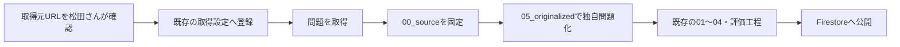

# 独自問題作成ワークフロー

この文書は、問題サイトや公式サンプルから取得した問題を、資格特有の出題傾向を保った暗記プラス独自問題として整備する共通方針の正本です。取得方法は[スクレイピングと`00_source`](scraping_workflow.md)、保存先は[artifact契約](artifact_contract.md)、公開fieldは[問題field契約](../reference/question_field_contract.md)を参照してください。

## 適用範囲

松田さんが取得元URLを確認した後、次の単位で処理方針をそろえます。問題ごとの取得元分類は追加しません。

- 取得元全体が公式過去問と確認できる場合は、既存の公式過去問工程へ進める。
- 公式サンプル、サイト独自問題、両者が混在する取得元は、全問を独自問題化する。
- 公式過去問か判断できない取得元も、原文を公開せず、独自問題化する。

取得元URLは、確認後に既存のスクレイピング設定へ登録します。この登録を確認済みの記録とし、`approved`や`contentOriginType`などの新しい管理fieldは作りません。

## 全体の流れ

公式過去問は`00_source`から既存の01以降へ進み、`05_originalized`を通りません。独自問題は`05_originalized`を現在入力としてから、既存工程を再利用します。

問題整備システムの05は明示選択で開始します。05 patchが作られた問題だけを以後の工程版・公開条件で追跡するため、公式過去問の通常整備へ05が自動混入しません。

## 取得単位とID

- 保存先は既存の`questions_json/<listGroupId>/`を使う。
- 独自問題の`listGroupId`には、取得元の講座又は問題集を識別できる安定名を使う。例: `udemy-ok-aws-e`。
- 原則として、取得元の1問から独自問題を1問作る。重複又は問題として成立しないものは作成せず、一つの問題から複数の類題を量産しない。分割が不可欠な問題だけを例外とする。
- 取得元の問題IDは既存の`source_question_id`へ保存する。サイトが持つ不変IDを優先し、なければ問題固有の安定URLを使う。
- 表示順、問題番号の並び、問題文ハッシュは恒久IDにしない。安定した問題IDも問題固有URLも得られない取得元は保留する。
- 公開用IDは既存方式で`source_question_id`から生成する取得元非表示の`public_question_id`を使い、別の対応表を作らない。選択肢単位の公開IDもMerge時に`public_question_id`から再生成する。取得元のIDやURLはFirestoreへ登録しない。
- 再取得時に同じ`source_question_id`が見つかった場合は、標準scraperが取得元の現在内容を`00_source`へ反映する。公開済み問題は自動更新せず、scrape reportの変更IDだけを05以降の再整備・再評価へ回す。新しいIDは新規問題として追加する。

## `05_originalized`の責務

`00_source`には、取得した問題文、選択肢、正答、解説を原文のまま保存します。手作業や独自問題化では変更せず、取得元が更新されたときだけ標準scraperが再取得します。

`05_originalized`には、公開の基礎となる次の既存fieldを保存します。

- 独自問題化した問題文
- 独自問題化した選択肢
- 正解と、その正解に至る判断条件
- `00_source`と対応する既存の問題ID

取得元の問題文や選択肢を`originalQuestionBodyText`、`originalQuestionChoiceText`などの公開fieldへ流しません。これらのfield名にある「original」は、Firestore上で分割する前の基礎問題を意味し、取得元の原文を意味しません。

解説は`05_originalized`で完成させず、既存の03で作成します。判断できない問題は既存のreview sidecar又は`hold`へ送り、新しい保留台帳は作りません。

## 独自問題化の基準

次の要素は維持します。

- 問われる知識と正解の根拠
- 難易度と、受験者に要求する判断
- 資格特有の設問形式、条件の示し方、自然な専門用語
- 正答と誤答を分ける技術的な決め手
- 誤答選択肢のもっともらしさと、問題を解くために必要な情報量

独自問題化では、元の問題が持つ学習上の質と資格固有の語感を保ち、問題文、選択肢又は選択肢の順番のうち、必要な部分だけを自然に変えます。問題文全体を別問題へ作り替えません。問題文を維持して、選択肢の一部又は順番だけを変えても構いません。

変更量を決める前に、対象資格の`prompt/qualification_docs/<qualification>/01_exam_profile.md`を読みます。資格別資料にある公式用語、設問の骨格、条件の置き方、比較軸を、一般的なシナリオ文へ置き換えません。直接知識を問う問題は直接問う形、図表の名称や対応を問う問題は図表問題のまま維持します。独自化のためだけに「企業が〜」で始まる状況問題へ広げたり、元の選択肢にない製品・制度・論点を追加したりしません。

次の要素は、暗記プラスの問題として自然になるように必要な範囲だけ整えます。

- 取得元に固有の場面設定、固有名詞、数値又は条件
- 問題文の情報順序、主語、表現
- 独自化した問題文との整合又は技術的な正確さのために変更が必要な選択肢
- 解説の論理構成と日本語

空白又は表記揺れだけで差を作りません。一方、AWSサービス名、法令名、専門用語など、正確さと資格らしさのために必要な語句は無理に変更しません。選択肢を変更する場合も、一つ又は必要最小限にとどめ、正答の決め手、誤答としてのもっともらしさ、要求する判断を変えません。選択肢を並べ替える場合は、各選択肢と正誤の対応も維持します。差を作ることだけを目的に書き換えず、変更文字数や類似率の数値基準も設けません。

公開前の機械チェックは、問題文と選択肢が順番も含めて両方とも取得元と完全一致する場合、又は取得元の解説と完全一致する場合だけを検出する最小限のものにします。問題文を維持して選択肢だけを変更又は並べ替えた問題は拒否しません。自然さ、難易度、資格らしさ、問題文と選択肢の整合、正答の妥当性は既存の評価工程で確認します。

## 事実確認と解説ナレッジ

- 取得元の解説は、説明すべき論点、迷いやすい点、情報順序を知るために使う。
- 技術的な事実と正答は、作成時点の公式試験ガイド、公式仕様、法令などで確認する。
- 取得元が古い場合は現行の公式情報へ合わせる。修正すると別問題になりすぎる場合は保留する。
- 取得元の解説文を転載せず、正解理由、誤答理由、類題で使える判断軸を暗記プラスの文章として作る。
- 複数問から一般化できた出題傾向は`prompt/qualification_docs/<qualification>/01_exam_profile.md`、解説方針は`02_explanation_strategy.md`へ反映する。
- 取得元ごとの文章例や専用ナレッジファイルは作らない。最初の複数問から共通傾向をまとめ、その後は新しい傾向が見つかった場合だけ資格別資料を更新する。

## 画像の扱い

- 公式過去問は、松田さんが取得元全体を公式過去問と確認した場合に限り、取得した問題画像と選択肢画像を従来の公式過去問工程で使用できる。権利関係を表す追加fieldは作らず、本プロジェクトの運用判断として取得設定への登録で確定する。
- 独自問題では、取得元の問題画像と選択肢画像をそのまま公開しない。画像内の関係、数値、ラベルなど、正答に必要な情報だけを基に新しい画像を作る。取得元のロゴ、透かし、装飾、配置を表面的に模倣しない。
- `00_source`に問題画像又は選択肢画像がある問題は、初期運用では画像添付が必要な問題と判定する。独自問題化で画像を使わない設問へ作り替えた場合も、この自動判定を個別に解除せず、独自生成画像を用意するか`hold`へ送る。
- 解説だけにある画像は、公開問題の成立に必要な画像とは判定しない。03の独自解説で図が必要な場合は、別途新しい解説画像を作る。
- 独自生成画像は`output/<qualification>/question_images/<listGroupId>/05_originalized/`へ保存する。ファイル名は`originalized_<public_question_id>_<用途>_<連番>.<拡張子>`とし、05 patchの`questionImageStorageUrls`又は`originalQuestionChoiceImageUrls`に公開用Storage URLを設定する。

画像が必要な独自問題は、次の順序で整備する。

1. 05 patchへ問題文・設問・選択肢・正答を保存し、その内容を先に確定する。この時点では画像URLを省略できる。
2. 05の論理projectionを基に、確定した問題を解くために必要な情報、ラベル、数値、位置関係を画像仕様として整理する。
3. 画像仕様から独自画像を作り、問題文・選択肢・正答との整合を確認する。
4. Storageへ保存し、公開用URLを同じ05 patchへ追記する。
5. 05を再投影し、画像を含む完成状態で01以降へ進める。

Mergeは`00_source`の画像有無から内部field`_independentImageRequired`を生成する。このfieldは公開停止判定にだけ使い、Firestore documentへ保存しない。画像なしの中間状態は論理projectionとして確認できるが、artifact同期、upload-ready生成、Firestore uploadはできない。取得元画像と同じURLを指定した場合、又は公開用画像のファイル名が`originalized_`で始まらない場合も公開準備を停止する。

## 公開契約

公開区分は既存の`isOfficial`だけで表します。

| 公開する問題 | `isOfficial` | `examYear` | `examSource` |
| --- | --- | --- | --- |
| 公式過去問 | `true` | 必須 | 既存の資格名・年度・問番号表示 |
| 暗記プラス独自問題 | `true` | field自体を保存しない | `独自問題` |
| ユーザー投稿 | `false` | このワークフローの対象外 | このワークフローの対象外 |

`isOfficial=true`は、試験実施団体が作成した問題だけでなく、暗記プラス運営が整備して公開する問題を表します。`contentOriginType`はFirestoreにも中間問題にも追加しません。

独自問題の`originalQuestionBodyText`、`originalQuestionChoiceText`、`questionText`、`explanationText`には、独自問題化した後の内容だけを入れます。`examYear`は空文字や`null`にせず、field自体を省略します。

暗記プラス独自問題は`examYear`を持ちませんが、`isOfficial=true`の公式問題です。01では公式過去問と同じく、回答体験を`true_false`、`flash_card`、`group_choice`のいずれかへ確定します。`single_choice`と`fill_in_blank`はユーザー作成問題だけの形式であり、このワークフローでは新規に設定しません。

## カテゴリと問題数

- 独自問題専用、Udemy専用、Ping-t専用などの`folder`や`questionSet`は作らない。
- 各問題は内容に合う既存の`category.json`へ分類し、公式過去問と同じ`questionSetId`へ配置できる。
- 問題数をそろえるために誤ったカテゴリへ入れたり、一つの取得問題から類題を量産したりしない。
- 問題数の偏りは既存データから集計し、不足する問題集を後続の独自問題作成で補う。不足数を保存するfieldは追加しない。

## 実装済みの公開ゲート

次の条件は既存のMerge、logical projection、convert、upload、requirementsへ接続済みです。独自問題はこれらの検証を通ったものだけを公開対象とします。

1. `05_originalized`を01より前のpatchとしてMergeへ反映する。
2. 独自問題では`examYear`を生成・uploadせず、`examSource="独自問題"`を設定する。
3. Firestore相当の`40_convert`とupload dataに、取得元の原文、解説、画像、URL、site IDが混入しないことを検証する。
4. 問題画像又は選択肢画像が必要な独自問題は、独自生成画像がある場合だけupload-readyとする。
5. 完全一致チェックと既存のquality gate、評価、readbackを通す。
