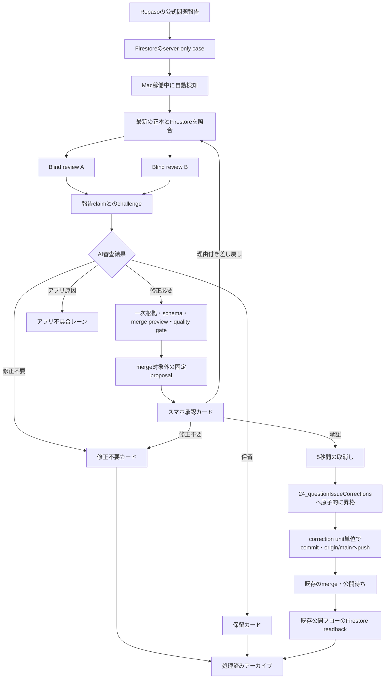

# ユーザーフィードバック対応システム

状態: 設計確定・実装前

最終更新: 2026-07-19

この文書は、Repasoから届くユーザーフィードバックをMac上でAI審査し、松田がスマホから一件ずつ最終判断する「ユーザーフィードバック対応システム」の目標仕様正本です。初版は公式問題の誤り報告だけを処理し、将来はアプリ不具合、UI改善、要望を同じシステムの別レーンとして追加します。

この仕様はまだ実装されていません。実装完了までは[公式問題の問題報告workflow](question_issue_report_workflow.md)が現行CLIの運用正本です。公式問題レーンのintake schema、blind review、許可field、`24_questionIssueCorrections`契約は同文書と[`config/question_issue_reports.json`](../../config/question_issue_reports.json)を再利用し、この文書では常駐処理、スマホ承認、patch確定、状態遷移だけを定義します。

## 目的と初版の境界

初版は、全資格の公式問題に対する全報告を対象にします。報告者の主張を正しいものとして扱わず、AI二者の独立審査、一次情報、機械検証を通過した判断材料を松田へ提示します。

- 初版の処理対象は、公式問題の問題文・選択肢、正答、解説、法令・制度、画像、分類、回答形式、その他の報告です。
- 問題データに差分がなくアプリ側の再現可能な原因がある場合は、question patchを作らず`アプリ不具合`レーンへ保存します。初版ではアプリコードを修正しません。
- 承認はFirestore公開ではありません。承認済みpatchを検証してGitへ保存し、次回の既存merge・公開フローへ合流させます。
- 管理者向け通知と、報告者への処理結果通知は初版に含めません。
- OpenAI Platform API、外部AI provider、ローカルLLMへのfallbackは行いません。

## 全体フロー



## 実行環境とアクセス

- 専用clean cloneの既定pathは`/Users/yuki/development/exam_scraper_feedback`とします。普段のDrive作業コピーと未コミット差分を共有しません。
- cloneは`main`だけを使い、処理前に`origin/main`とfast-forwardで同期します。別branch、force push、自動stash、他作業の巻き戻しは禁止します。
- serverはMacログイン時に`launchd`から起動し、異常終了時は自動再起動します。画面から一時停止と再開ができます。
- serverは`127.0.0.1`だけへbindします。スマホからはTailscale Serveのprivate HTTPSだけを使い、Tailscale Funnel又は公開インターネットへ露出しません。
- Tailscale接続を承認権限とし、passkey、Face ID、追加PINは要求しません。
- Codex App Server clientは既存の問題整備システム実装を共有します。caseは順番に処理し、同一caseのAI-AとAI-Bだけを別sessionで並行実行します。
- Codex App Server、Firestore又はGitHubが利用できない間はcaseを失わず待機します。別経路へfallbackしません。

## 自動intakeと重複処理

Mac稼働中は新着caseを自動検知し、server再起動時には未完了caseを再照合します。Macがスリープ中の新着は復帰後に取り込みます。

- caseの同一性は現行どおり`questionId + reported content hash + category`で管理し、複数カテゴリは内部では別caseのまま保持します。
- 同一内容の再報告はcaseを再審査せず、同一報告数だけを加算します。
- 既に`修正不要`となったcaseも、問題内容が同一なら再開しません。正本又はFirestoreの内容hashが変わった場合だけ最新内容で再審査します。
- AI審査は報告時snapshotではなく、最新のリポジトリ正本projectionとFirestore readbackを基準にします。両者の対応を一意に確定できないcaseは`システム対応待ち`へ送ります。
- 全資格・全報告を初回リリース時から有効にし、資格単位のlive pilotは設けません。fixtureと自動gateを全件有効化の前提にします。

## AI審査と根拠

### Blind A/Bとchallenge

1. AI-AとAI-Bは別sessionで、raw report、case ID、報告数、他方の結果を見ずに最新問題を独立審査します。
2. 公式資料、法令、規格、所管官庁資料などの一次情報だけを最終根拠に採用します。一般サイトや教材は一次情報を探す手掛かりに限ります。
3. A/Bの結果を固定した後だけ、sanitized report本文を`untrustedReportData`としてchallengeへ渡します。報告本文内のURLは自動で開きません。
4. A/Bの結論、構造化変更、一次根拠が一致した場合だけ`修正必要`にできます。両者が問題なしなら`修正不要`、不一致又は根拠不足なら`保留`です。
5. 法令・制度報告は現行法監査の三段階監査を省略しません。出題当時の公式正答と現行法上の学習用正誤を分けてカードへ表示します。

### 修正カードを作れる事前gate

`修正必要`カードは、次をすべて完了した固定proposalだけを表示します。

- blind review A/Bとchallengeの契約検証
- 一次根拠のlocator、該当箇所、基準日、取得日時の確認
- カテゴリ別許可field、field schema、必須値の検証
- 最新正本projectionとFirestore readbackのidentity・hash照合
- `00_source`不変、問題ID不変、関連recordの完全性確認
- correction unit全体の論理merge preview
- 変更後recordに対するquality gate
- 正式patchへ決定論的に昇格できるproposal hashの確定

検証できない修正案は承認可能にしません。業務判断を確定できないcaseは`保留`、runtime、identity、Git、schemaなどの技術的不備は`システム対応待ち`として分離します。`修正不要`と`保留`はpatchを持たないため、最新hashと審査result contractだけを検証します。

## 承認待ちproposal

未承認案はmerge対象外へ保存します。

```text
output/user_feedback_response_system/
  cases/<caseId>/
    case.json
    progress.jsonl
    technical_log.jsonl
  proposals/<caseId>/<proposalHash>/
    manifest.json
    proposed_patch.json
    review_a.json
    review_b.json
    challenge.json
```

- `output/user_feedback_response_system/`はprivateな運用領域であり、Gitへ追加しません。
- raw commentとreporter情報はprivate intakeから通常ログ、proposal、patch、Gitへコピーしません。画面用の報告本文は個人情報を除去したsanitized本文に限ります。
- proposalは入力hash、policy fingerprint、AI-A/B session、実model、challenge hash、一次根拠、correction unit、変更前後、merge preview結果を持ちます。思考過程は保存しません。
- pending proposalの入力、policy又は内容が変わった場合は旧proposalを承認不能にし、最新内容で再生成します。

## スマホ画面

### 件数一覧

最初の画面には次を表示します。

- 未確認総数と、修正候補・修正不要・保留の内訳
- 最も古い報告の経過日数と推定確認時間
- 資格・カテゴリ・状態のfilter
- `全ケース`と`修正候補のみ`の手動切替
- AI、Firestore、Git、serverの簡潔なhealth状態

初期値は`全ケース`です。未確認が30件を超えた場合、systemは`修正候補のみ`への切替を提案できますが、自動では切り替えません。非表示になった修正不要・保留caseも保存し、後から確認できます。

集中モードは影響度が高い順、その中で古い順に一枚ずつ表示します。優先度は、正答又は問題成立性、法令・制度、問題文・選択肢・画像、解説、分類・回答形式・その他の順です。同一報告数は表示しても、正しさ又は優先順位の根拠には使いません。

### 承認カード

初期表示は判断に必要な要約に絞り、詳細を展開式にします。

- AIの結論: 修正必要、修正不要、保留
- 資格、年度、問題番号、カテゴリ
- 現在値と修正後のfield単位diff
- 修正理由と受験者への影響
- 公式・一次根拠の名称、該当箇所、基準日、取得日時、link
- AI-A/Bの一致、不一致又は根拠不足
- 変更field数、関連record数、correction unitの全範囲
- 事前gateの結果、proposal hash、正式patchの予定path
- `Firestoreにはまだ反映されない`という明示

詳細欄にはsanitized報告本文と同一報告数、AI審査結果、根拠の詳細、技術情報を置きます。UID、メールアドレス、連絡先は表示しません。

### 操作

| AI結果 | 松田の操作 | 結果 |
| --- | --- | --- |
| 修正必要 | `修正patchを承認` | 5秒後に正式patchへ昇格する。 |
| 修正必要 | `修正不要` | 理由任意で終了する。 |
| 修正必要 | `理由を添えてAIへ差し戻す` | 新しいproposalを再提示する。 |
| 修正不要 | `修正不要として承認` | 理由任意で終了する。 |
| 修正不要 | `理由を添えてAIへ差し戻す` | 最新内容を再調査する。 |
| 保留 | `保留として確認` | 通常一覧から保留一覧へ移す。 |
| 保留 | `修正不要` | 理由任意で終了する。 |
| 保留 | `理由を添えて再調査` | 新しい審査を開始する。 |

承認又は修正不要を一タップで受け付け、次のカードへ進みます。画面下部に5秒間`取り消す`を表示し、その間はpatch昇格又はcase終了を開始しません。5秒経過後の訂正は、元履歴を削除せず、打ち消す新しいcorrection patch又は新しい判断履歴として通常の承認を受けます。

## correction unit、patch、Git

- 一回の承認は、整合性を保つために必要な全fieldと全関連recordを一つのcorrection unitとして扱います。一部field又は一部siblingだけを承認できません。
- 5秒経過後、proposal hashと最新入力hashを再確認し、一致した場合だけ`24_questionIssueCorrections/`へ原子的に昇格します。
- patch schema、許可field、identity、`expectedBeforeHash`は[公式問題の問題報告workflow](question_issue_report_workflow.md)に従います。
- 正式patchへ昇格したcorrection unitは、専用clean cloneの`main`へ一件ずつcommitし、`origin/main`へpushします。他のpathを同じcommitへ含めません。
- patch確定とGit反映はFirestore公開と分離します。承認直後にphysical merge、upload、Firestore書込みを行いません。
- 次回の既存問題公開フローがmergeすると、承認済みpatchを他patchとともに反映します。quality gate、upload確認、Firestore書込み、live readbackは既存公開フローの責務です。
- target fieldのlive readbackが一致した後だけ、フィードバックcaseを`公開済み`にします。報告者へ結果は返しません。

## 失敗、再試行、訂正

- 承認済みproposal hashと正式patch内容が変わらない限り、松田の承認を維持します。
- 通信、一時的なGitHub障害などの回復可能な失敗は、間隔を空けて最大3回自動再試行します。
- schema、identity、quality gateなど決定的な検証失敗は自動再試行せず、`システム対応待ち`へ送ります。
- `origin/main`競合はfetch、fast-forward可否、最新hashを再検証してから再試行します。内容が変われば承認を無効化し、新しいカードを提示します。
- 3回失敗した処理は承認を失わず`手動対応待ち`へ移します。他caseの審査と閲覧は継続します。
- 5秒経過後に誤りへ気付いた場合、元patch又はcommitを削除しません。現在projectionを打ち消す新しいcorrection patchをAIが作り、改めて承認、commit、pushします。

## 状態とアーカイブ

実装時は現行`workflowStatus`を次の意味へ移行し、設定とstoreを同時に更新します。

| 状態 | 意味 |
| --- | --- |
| `unreviewed` | intake済み、AI審査前 |
| `reviewing` | 最新照合又はAI-A/B/challenge実行中 |
| `ready_for_approval` | 検証済みの修正候補、修正不要又は保留を人間確認待ち |
| `approval_undo_window` | 一タップ操作後の5秒取消し期間 |
| `approved_patch_pending` | 修正案承認済み、正式patch又はGit反映待ち |
| `committed_publish_waiting` | patchをcommit・push済み、既存公開フロー待ち |
| `reviewed_no_change` | 松田が修正不要を確定 |
| `reviewed_hold` | 松田が保留を確認 |
| `app_update_queued` | アプリ原因を別レーンへ保存 |
| `system_attention` | runtime、schema、identity、Gitなどの手動対応待ち |
| `published` | 既存公開フローのFirestore readback一致済み |

処理済みcaseは削除せずアーカイブします。AI-A/Bとchallengeの結果、松田の判断と日時、proposal/patch hash、patch path、Git commit、検証・再試行・公開状態、訂正関係を検索可能にします。raw report、reporter情報、思考過程はアーカイブへ含めません。

## 精度指標と改善

資格・カテゴリ単位で次を集計します。

- AI判定と松田の一致率
- AIの修正候補を松田が`修正不要`にした割合
- 差し戻し率と正規化した理由
- 保留率
- 訂正patch発生率
- 審査時間、承認待ち時間、Git反映待ち時間

AIは指標からprompt、checker、UIの改善案を別artifactへ作れますが、正本、prompt、checkerを自動変更しません。改善はactive case処理と分離した別作業で確認、テスト、承認してから反映します。

## 初版に含めないもの

- アプリ不具合、UI改善、要望に対するコード自動修正
- feedback systemからのFirestore問題データ公開
- 報告者への個別回答又は対応結果通知
- 松田へのpush、メール、ブラウザ通知
- public web公開、Tailscale外からのアクセス
- スマホ上でのpatch直接編集
- AIによるprompt、checker、policyの自動変更

実装順、テスト、全資格・全報告を有効化する完了条件は[`2026-07-19_user_feedback_response_system_implementation_plan.md`](../temporary/2026-07-19_user_feedback_response_system_implementation_plan.md)を参照してください。
